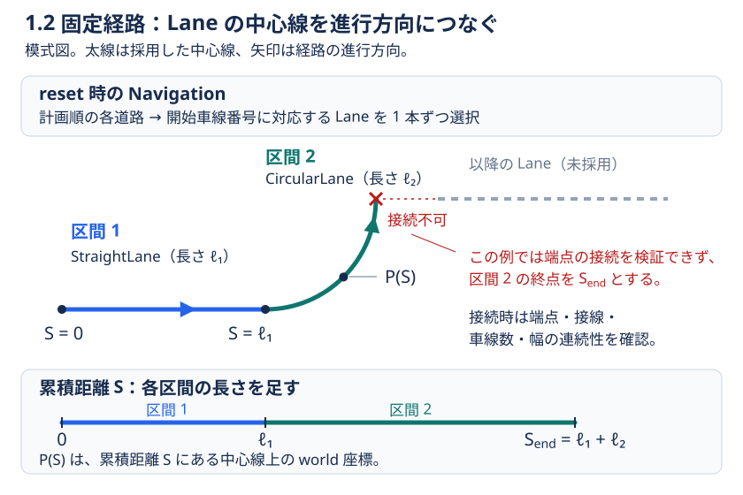
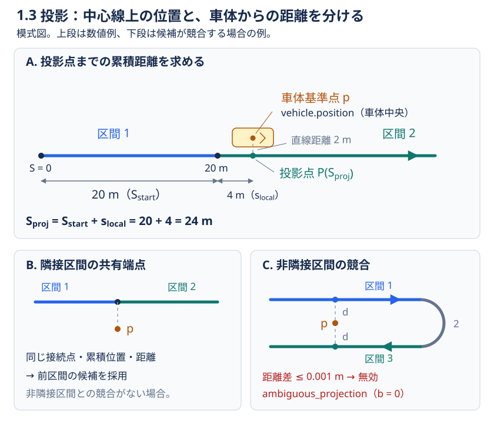
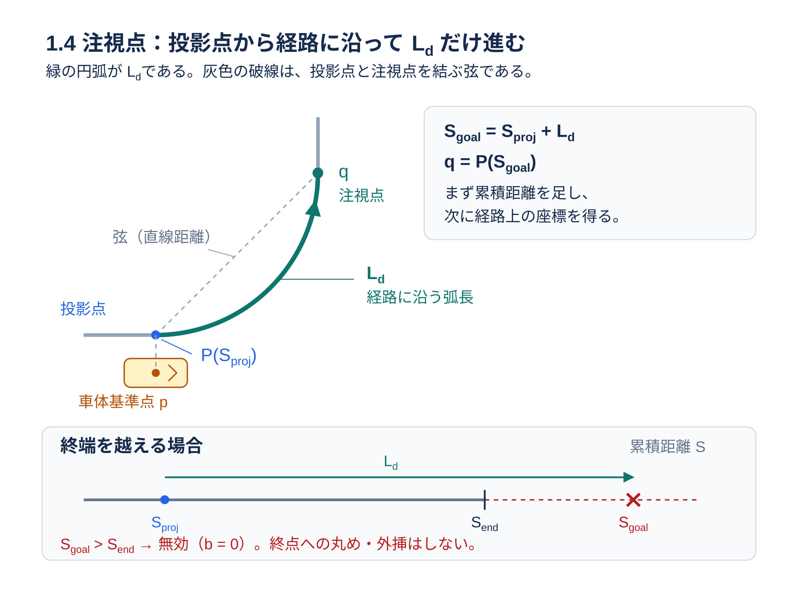
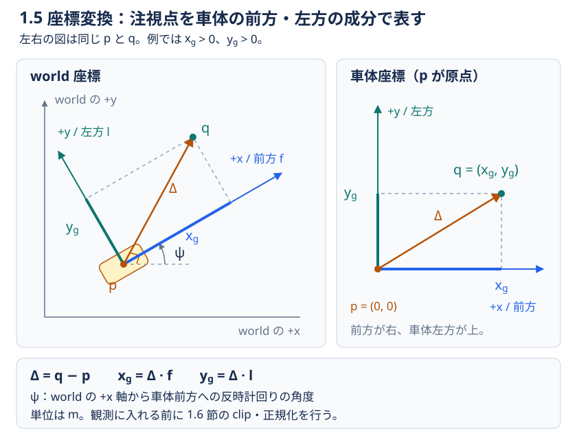

# lookahead の観測入力と報酬関数の仕様

lookahead_learning は、既存環境を包む `LookaheadEnv` ラッパーで、観測と独立に切り替えられる2種類の報酬項を追加します。

- **観測拡張**：既存環境の観測末尾に、経路に沿った前方の注視点を 3 値で追加します。
- **操舵に関する報酬補正**：前方注視点へ向かう操舵を促すため、設定が有効な場合に、
  Pure Pursuit（PP）が計算したお手本の操舵値と実際に適用された操舵との差をペナルティとして
  元の報酬に加えます。
- **参照経路の必要横加速度に関する報酬補正**：投影点から注視点までの最大曲率と
  行動後の速度から必要横加速度を求め、許容値を超えた分へ負の報酬を加えます。
  省略時はOffです。詳細は [新項の仕様](lateral_acceleration_reward.md) を参照してください。

用語は次のように使います。

| 用語 | 定義 |
|---|---|
| **既存環境（ホスト環境）** | lookahead を追加する前の環境。以降の本文では「既存環境」と呼びます。 |
| **decision（行動ステップ）** | 方策が Action を 1 回選んで適用し、次の観測・報酬・終了フラグを受け取る単位。コードの 1 回の `env.step(action)` に対応します。 |
| **pre-action** | 今回の Action を既存環境へ適用する前の状態です。 |
| **post-action** | 同じ Action による既存環境の step が完了した後の状態です。 |
| `snapshot` | 状態と、その状態から計算した値をまとめて保存したデータです。 |

行動ステップの番号を $t=0,1,2,\ldots$ とします。$t$ は秒時刻ではなく、Action を
適用する順番です。1 行動ステップ中に物理計算を複数回行うことがあります。たとえば
物理計算が 0.02 秒刻みで同じ行動のまま 5 回進める設定なら、経過時間は 0.1 秒です。

## 最初に：pre-action と post-action の境界

境界は、`LookaheadEnv.step(action)` 内の **`self.env.step(action)` の前後**です。
ここでの「入力」は方策への観測です。**今回の入力は `step(action)` を呼ぶ前に使い、
`step()` には決定済みの `action` を渡します。**

| 情報の時点 | 使う情報 | 今回の 1 step での用途 | 該当節 |
|---|---|---|---|
| pre-action（行動前） | 注視点の正規化座標 2 値と、注視点を利用できるかを示すフラグ | **今回の入力（観測）**。 | [1.1 元の観測と拡張後の観測](#11-元の観測と拡張後の観測)、[1.6 有効判定と正規化](#16-注視点の有効判定と正規化) |
| pre-action（行動前） | PP が計算したお手本の操舵値 $u_{\mathrm{pp},t}$ と、報酬の比較基準として使えるかを示すフラグ `pp_valid` | **今回の報酬**の比較基準。 | [2.2 お手本の操舵値](#22-pre-action-の注視点から-pp-操舵を求める)、[2.4 計算条件](#24-追加報酬の計算条件と時間重みのスケール) |
| post-action（行動後） | 実際に適用された操舵・元の報酬・終了フラグ | **今回の報酬**の計算に使用。 | [2.1 元の報酬](#21-元の報酬を受け取る)、[2.3 実操舵](#23-実際に適用された操舵をリード)、[2.4 補正](#24-追加報酬の計算条件と時間重みのスケール)、[2.5 加算](#25-元の報酬へ加算して返す) |
| post-action（行動後） | 注視点の正規化座標 2 値と、注視点を利用できるかを示すフラグ | **次回の入力（観測）**。 | [1.6 有効判定と正規化](#16-注視点の有効判定と正規化) |
| post-action（行動後） | PP が計算したお手本の操舵値 $u_{\mathrm{pp},t+1}$ と、報酬の比較基準として使えるかを示すフラグ `pp_valid` | **次回の報酬**の比較基準として保存。 | [2.2 お手本の操舵値](#22-pre-action-の注視点から-pp-操舵を求める) |

`step()` は、**今回の報酬と、行動後の状態から作った次回用の観測**を返します。
PP 報酬モードでは、**行動前に PP が計算したお手本の操舵値 $u_{\mathrm{pp},t}$ と、
今回の実操舵 $u_{\mathrm{applied},t}$ を比較し、元の報酬に補正を加えます。**
継続時は、今回の post-action が次回の pre-action になります。
`reset()` は初期状態（$t=0$）から最初の観測を作り、報酬は返しません。
表中の PP に関する処理は PP 報酬モードのみです。
新項では pre-action の同じ参照区間と最大曲率 K_t を保存し、post-action の
平面速度 v_{t+1} で今回の報酬を計算します。post の注視点や曲率への置換は行いません。

## 1. 観測の生成・変換

### 1.1 元の観測と拡張後の観測

行動ステップ $t$ の既存環境の観測を $o_t^{\mathrm{raw}}$、その要素数を $D$ とします。
$D$ は移植先の観測空間が決める値であり、lookahead_learning が固定する値ではありません。
元の観測は 1 次元の有限な float32 ベクトルです。表や単一時点の具体例では、添字
$t$ を省略して書くことがあります。その場合も同じ行動ステップの値を指します。
観測は次のベクトルとして扱います。

$$
o_t^{\mathrm{raw}}
 =
\left(o_{t,1}^{\mathrm{raw}},\ldots,o_{t,D}^{\mathrm{raw}}\right)
\in \mathbb{R}^{D}.
$$

各要素の意味、単位、値域、並び順は既存環境の定義をそのまま引き継ぎます。
元の $D$ 要素の並び順・要素数・値は変えません。そのまま観測の先頭部分（prefix）として使います。

通常の TOML 設定から作るモードは次のとおりです。ここで $r_t^{\mathrm{base}}$ は
既存環境の step が返した報酬であり、追加報酬については後の節で定義します。

| 設定 | 方策に渡す観測 | step が返す報酬 |
|---|---|---|
| [lookahead] なし | 元の $D$ 要素 | $r_t^{\mathrm{base}}$ |
| [lookahead] あり、pp_weight = 0、新項Off | 元の $D$ 要素と注視点の 3 要素 | $r_t^{\mathrm{base}}$ |
| [lookahead] あり、pp_weight > 0、新項Off | 元の $D$ 要素と注視点の 3 要素 | 元の報酬と PP 追加報酬の和 |
| [lookahead] あり、pp_weight = 0、新項On | 元の $D$ 要素と注視点の 3 要素 | 元の報酬と必要横加速度の追加報酬の和 |
| [lookahead] あり、pp_weight > 0、新項On | 元の $D$ 要素と注視点の 3 要素 | 元の報酬と両追加報酬の和 |

注視点の 3 要素を並べたベクトルを $\phi_t$ とします。
コード上の名前・数式の記号の対応は次のとおりです。

| コード上の名前 | 数式の記号 | 意味 |
|---|---|---|
| `x_norm` | $x_t^{\mathrm{norm}}$ | 前後方向の座標を正規化した無次元値 |
| `y_norm` | $y_t^{\mathrm{norm}}$ | 左右方向の座標を正規化した無次元値 |
| `preview_valid` | $b_t$ | 注視点を利用できるかを表す数値フラグ |

下付きの $t$ は行動ステップの番号、上付きの $\mathrm{norm}$ は
「正規化済み」を表すラベルです。$\mathrm{norm}$ は累乗の指数ではありません。

$$
\phi_t
 =
\left(x_t^{\mathrm{norm}},\ y_t^{\mathrm{norm}},\ b_t\right).
$$

$b_t=1.0$ は注視点が有効、$b_t=0.0$ は注視点を無効と判定したことを表します。
lookahead モードでは、最終的な観測は元の prefix の末尾に $\phi_t$ を連結した
次のベクトルです。ここで concat は要素を順番どおりに後ろへ連結する操作です。

$$
\begin{aligned}
o_t
 &=\operatorname{concat}\!\left(o_t^{\mathrm{raw}},\phi_t\right)\\
 &=\left(
 o_{t,1}^{\mathrm{raw}},\ldots,o_{t,D}^{\mathrm{raw}},
 x_t^{\mathrm{norm}},y_t^{\mathrm{norm}},b_t
 \right)
 \in \mathbb{R}^{D+3}.
\end{aligned}
$$

元の観測空間（Box）の上下限はそのまま prefix に使われ、追加 3 要素の上下限は
$[0,1]$ です。したがって lookahead 観測は float32 の $D+3$ 要素になります。
baseline モードでは $\phi_t$ を付けず、元の $D$ 要素をそのまま返します。

### 1.2 固定経路を作る

reset の直後に、`MetaDrivePreviewProvider` は `Navigation` が持つ計画済みの有向経路を
読み取ります。固定経路を構成する **区間** は、**1 車線分の Lane オブジェクト**に対応し、
その車線の中心線の始点から終点までを表します。`StraightLane` は直線、
`CircularLane` は円弧の区間です。

計画経路上の各道路から、reset 時に記録した開始車線番号に一致する 1 車線を選び、
接続端点・接線・車線数・幅の連続性を確認して、進行方向につなぎます。
接続を検証できない境界があれば、その手前までを固定経路とし、エピソード中は
この経路を使います。
別車線も含めて接続先を一意に検証できない場合は、そこで経路を打ち切ります。

固定経路の始点を 0 m とする累積距離を $S$ [m] とし、その位置の world 座標
（地図上の共通座標系）を $P(S)$ と表します。$P(S)$ は 2 次元の点です。
終端までの累積距離を $S_{\mathrm{end}}$ [m] とすると、経路の定義域は
$0\leq S\leq S_{\mathrm{end}}$ です。

道路・車線・区間の関係、接続の検証条件、累積距離の具体例については、
補足文書 [固定経路の定義と構築](route_definition.md) を参照してください。

1.2〜1.5 節の図は模式図です。図中では、同じ行動ステップを表す添字 $t$ を省略します。

図の下段は、同じ経路を累積距離 $S$ の軸で表しています。区間ごとに $S$ を 0 に戻さず、
前の区間までの長さを引き継ぎます。

### 1.3 車体基準点と投影

ここでいう **車体基準点** は、車両の物理モデルで「車両がどこにいるか」を表す
ために定めた点です。この実装では、MetaDrive の `vehicle.position` が返す
車体原点の平面座標を使います。
`DefaultVehicle` では、この原点は物理モデルの車体形状の前後・左右の中央に
設定されています。

この点を、経路への投影と、注視点が車体から前後・左右に何 m 離れているかを測る
基準にします。PP 計算で使う後輪車軸の中心は、この点から `REAR_WHEELBASE` だけ
車体後方へ移動して求めます。両者の座標の関係は 2.2 節で説明します。
コードでは [adapter.py](../adapter.py) の `read_vehicle_state()` が
`vehicle.position` の 2 成分を読み取っています。

行動ステップ $t$ の車体基準点の world 座標を $p_t$ [m] とします。
固定経路全体から、車体基準点に対応する中心線上の点を **投影点** として一つ選びます。

1. **各区間で候補を一つ残す**：各区間の始点・終点と、区間内にある投影候補を、
   車体基準点までの直線距離で比較します。その区間で最も近い一点を残します。
   車体が区間の範囲外にあっても、端点を候補にできます。
2. **区間同士の候補を比較する**：各区間から残した候補のうち、直線距離が最も小さい
   候補を `best` とします。同距離なら、固定経路の累積距離が小さい候補を選びます。
   `best` は暫定候補です。残りの候補も保持し、手順3で競合を確認して採用可否を決めます。
3. **投影点を確定する**：`best` とほぼ同距離の候補がある場合は、区間の並び順を
   確認します。固定経路上で前後に隣り合う区間を **隣接区間**、それ以外を
   **非隣接区間** と呼びます。次の順に判定します。

   - **非隣接区間の競合**：`best` の区間に対し、非隣接区間にも距離差が
     0.001 m 以下の候補があれば、投影先を確定できないと判定します
     （`ambiguous_projection`）。
     U 字に折り返す経路では、往路と復路が同じ距離の候補になり得ます。
   - **隣接区間の共有端点**：非隣接区間の競合がなく、前区間の終点と次区間の始点が
     同じ接続点を表し、同じ累積位置・距離と判定できれば、前区間の候補を採用します。
   - **それ以外**：`best` を採用します。候補が競合しない場合も、この扱いです。

投影点の選択は [geometry.py](../geometry.py) の `project_to_path()` が行います。
投影先を確定できない場合を含む、注視点の有効判定は
[1.6 節](#16-注視点の有効判定と正規化)にまとめています。

投影点を選べた場合、その点まで、**固定経路の始点を 0 m として、レーン中心線に沿って測った距離**を
$S_{\mathrm{proj},t}$ [m] とします。投影先に選ばれた区間の始点の累積距離を
$S_{\mathrm{start},t}$ [m]、その区間の始点から投影点までの距離を
$s_{\mathrm{local},t}$ [m] とすると、次の和です。

$$
S_{\mathrm{proj},t}
 = S_{\mathrm{start},t}+s_{\mathrm{local},t}.
$$

たとえば最初の区間が 20 m で、投影点が次の区間の始点から 4 m 先なら、
$S_{\mathrm{proj},t}=20+4=24\,\mathrm{m}$ です。車体と投影点の間が 2 m 離れていても、
その 2 m は投影候補を比較するための直線距離で、累積距離の和には含めません。
累積距離の原点は固定経路の始点です。reset 時の車体位置からの移動距離や、
実際に走った距離の積算値とは区別します。

上段では、経路に沿う 20 m と 4 m を足して投影位置を求めます。車体からの直線距離
2 m はこの和に含みません。下段は、同じ共有端点として処理できる場合と、折り返した
別区間との競合により投影を無効にする場合の違いです。

### 1.4 注視点を経路上で決める

設定の lookahead_m を、ここでは $L_d$ [m] と書きます。$L_d$ は world 座標上の
直線距離ではなく、$P(S)$ に沿って進む弧長です。投影位置から $L_d$ だけ進んだ
経路上の累積距離を $S_{\mathrm{goal},t}$、そこでの world 座標を注視点 $q_t$ [m]
とすると、計算は次の 2 段階です。

$$
\begin{aligned}
S_{\mathrm{goal},t} &= S_{\mathrm{proj},t}+L_d,\\
q_t &= P\!\left(S_{\mathrm{goal},t}\right).
\end{aligned}
$$

たとえば直線上で $L_d=6\,\mathrm{m}$ なら、車体の投影位置から道路に沿って
6 m 先の点を使います。曲線では、world 座標間の弦の長さが 6 m になる点では
ありません。注視点を計算できる経路範囲と、範囲を超えた場合の扱いは
[1.6 節](#16-注視点の有効判定と正規化)にまとめています。

緑の円弧の長さが $L_d$ です。灰色の破線は投影点と注視点を結ぶ弦で、
この長さを $L_d$ に合わせる計算ではありません。下段は world 座標の延長ではなく、
終端超過を判定するための累積距離 $S$ の軸です。

### 1.5 world 座標から車体座標へ変換する

この節の車体座標は次の向きと単位です。

- **原点**：車体基準点。行動ステップ $t$ の world 座標を $p_t$ [m] と書きます。
- **x 軸**：車体前方が正の前後方向 [m]。
- **y 軸**：車体左方が正の左右方向 [m]。

車体の heading を $\psi_t$ [rad] とします。$\psi_t$ は world の x 軸から
車体前方へ反時計回りに測った角度です。車体前方と車体左方の world 単位ベクトルを
それぞれ $\mathbf f_t$ と $\mathbf l_t$ とすると、実装は次を使います。

$$
\mathbf f_t
 =
\left(\cos\psi_t,\sin\psi_t\right),
\qquad
\mathbf l_t
 =
\left(-\sin\psi_t,\cos\psi_t\right).
$$

$q_t$ と $p_t$ の world 座標差を $\Delta_t$ [m] と定義します。車体座標での
前後方向成分を $x_{g,t}$、左右方向成分を $y_{g,t}$ とします。記号 $\cdot$ は
2 次元ベクトルの内積です。

$$
\begin{aligned}
\Delta_t &= q_t-p_t,\\
x_{g,t} &= \Delta_t\cdot\mathbf f_t,\\
y_{g,t} &= \Delta_t\cdot\mathbf l_t.
\end{aligned}
$$

$x_{g,t}$ と $y_{g,t}$ は、上の座標系で測った距離 [m] です。この段階では観測へ
直接入れず、後述の正規化を通します。PP 計算で使う後輪車軸の原点とは異なります。

左図では world 座標の中に車体の軸を重ね、右図ではその車体の軸を右向き・上向きに
そろえて描いています。どちらも同じ $\Delta_t=q_t-p_t$ を表し、青の成分が
$x_{g,t}$、緑の成分が $y_{g,t}$ です。原点は車体基準点のままです。

### 1.6 注視点の有効判定と正規化

$b_t$ は、注視点を利用できるかの判定結果を、観測用の数値にしたものです。
**以下の条件をすべて満たすと、注視点を有効と判定します。**

- **固定経路を利用できる**：reset 時に構築した固定経路があり、空でない。
- **計画経路が変わっていない**：Navigation の計画経路（checkpoints）が reset 時と同じである。
- **開始車線の参照が有効である**：既存環境が開始車線番号や必要な target レーン参照を
  公開する場合、reset 時に保存した開始車線番号が変化せず、必要な参照が有効である。
  参照を公開しない場合は、reset 時に固定した Navigation 経路を使う。
  単に走行中のレーンが変わったことだけでは、無効にしない。
- **車体の位置と向きを取得できる**：車体位置 $p_t$ と heading $\psi_t$ が取得でき、
  その値が有限である。
- **投影点を確定できる**：1.3 節の手順で有限な座標の投影候補を計算でき、投影先を
  確定できる。最も近い候補 `best` に対し、非隣接区間に距離差 0.001 m 以下の候補が
  ある場合は、この条件を満たさない（`ambiguous_projection`）。
- **注視点を固定経路内で計算できる**：$S_{\mathrm{goal},t}\leq S_{\mathrm{end}}$ であり、
  その位置の注視点座標 $q_t$ と経路の向きを有限な値として計算できる。
  $S_{\mathrm{end}}$ は検証済みの固定経路の終端である。終端を超えた場合に、終点へ
  clamp して短い注視距離として扱ったり、検証できない区間の先へ外挿したりはしない。
- **前進速度が条件を満たす**：前進速度を取得できる場合、その値が有限で、
  $-0.1\,\mathrm{m/s}$ 以上である。停止や低速だけを理由に無効にはしない。
- **注視点が車体の前方にある**：$x_{g,t}>10^{-3}\,\mathrm{m}$ である。
- **注視点が車体から十分に離れている**：$\lVert q_t-p_t\rVert_2>10^{-3}\,\mathrm{m}$ である。
  ここで、2 次元ベクトル $\mathbf z=(z_1,z_2)$ のユークリッドノルム（距離）を
  $\lVert\mathbf z\rVert_2=\sqrt{z_1^2+z_2^2}$ と書く。

既存環境が adapter の契約を満たさない値を返した場合は例外となり、上記の条件で
判定する注視点無効とは区別します。判定は [adapter.py](../adapter.py) の
`MetaDrivePreviewProvider.__call__()` と、[geometry.py](../geometry.py) の
`project_to_path()`・`compute_preview()` に対応します。

有効なら `preview_valid=True`、無効なら `preview_valid=False` の結果を返します。
観測では、この結果を次の $b_t$ に変換します。

$$
b_t
 =
\begin{cases}
1.0, & \text{上記の条件をすべて満たすとき},\\
0.0, & \text{いずれかの条件を満たさないとき}.
\end{cases}
$$

無効な場合（$b_t=0.0$）は座標を正規化せず、追加観測を $(0.5,0.5,0.0)$ とします。
以下の clip・正規化は、**注視点が有効な場合（$b_t=1.0$）だけ**行います。
clip は座標の値域を調整する処理であり、注視点を利用できるかを示すフラグを変更しません。

正規化の前に、任意の実数 $z$ を区間 $[-1,1]$ に収める関数を定義します。

$$
\operatorname{clip}(z,-1,1)=\min\!\left(\max(z,-1),1\right).
$$

符号付きの座標 $v$ [m] を観測値へ変換する関数 $n(v)$ を、10 m を基準として
次のように定義します。実装では m 単位の座標値を数値 10.0 で割ります。

$$
n(v)
 =
\frac{
\operatorname{clip}\!\left(v/(10\,\mathrm{m}),-1,1\right)+1
}{2}.
$$

この $n(v)$ は無次元で、値域は $[0,1]$ です。したがって車体座標から観測値への
変換は次のようになります。

$$
x_t^{\mathrm{norm}}=n\!\left(x_{g,t}\right),
\qquad
y_t^{\mathrm{norm}}=n\!\left(y_{g,t}\right).
$$

注視点が有効（$b_t=1.0$）な場合、$x_{g,t}$ または $y_{g,t}$ が $+10$ m 以上なら
対応する値は 1.0、$-10$ m 以下なら 0.0 になります。これが clip の役割です。0 m は
0.5 に写るため、$b_t$ と一緒に読んで区別します。

### 1.7 数値例

たとえば既存環境の観測が $D=4$ 要素であるとし、1.1 節の記号で
$o_t^{\mathrm{raw}}=(o_{t,1}^{\mathrm{raw}},\ldots,o_{t,4}^{\mathrm{raw}})$ と書きます。
この 4 要素は注視点の 3 値の計算には使わず、最後にそのまま連結します。

車体座標での注視点が $x_g=12\,\mathrm{m}$、$y_g=-3\,\mathrm{m}$ で、
注視点が有効だとします。このとき

$$
n(12\,\mathrm{m})=1.0,
\qquad
n(-3\,\mathrm{m})=\frac{-0.3+1}{2}=0.35,
\qquad
\phi_t=(1.0,0.35,1.0).
$$

方策に渡す観測は次のとおりです。元の 4 要素はそのままで、末尾に 3 要素だけが加わります。

$$
o_t=\left(o_{t,1}^{\mathrm{raw}},\ldots,o_{t,4}^{\mathrm{raw}},1.0,0.35,1.0\right).
$$

### 1.8 実装上の対応

観測の各処理は次の実装に対応します。

| 処理 | 実装上の対応 | 主な値と単位 |
|---|---|---|
| 既存環境の観測の検証 | [adapter.py](../adapter.py) の ObservationContract.validate_raw | $D$、float32、既存環境定義の値域 |
| 固定経路と注視点 | [adapter.py](../adapter.py) の MetaDrivePreviewProvider、[geometry.py](../geometry.py) の compute_preview | $P(S)$、$S_{\mathrm{proj}}$、$S_{\mathrm{goal}}$ は m |
| world から車体座標 | [geometry.py](../geometry.py) の compute_preview | $x_g,y_g$ は m、前方・左方が正 |
| 正規化と無効値 | [env.py](../env.py) の PreviewState.observation_values、[adapter.py](../adapter.py) の normalize_preview_coordinate | $x_t^{\mathrm{norm}},y_t^{\mathrm{norm}}\in[0,1]$ |
| 末尾への連結 | [adapter.py](../adapter.py) の ObservationContract.append_preview | 出力は $D+3$ 要素 |

## 2. 報酬の計算

### 2.1 元の報酬を受け取る

行動ステップ $t$ の Action を $a_t$、既存環境の step が返すスカラー報酬を
$r_t^{\mathrm{base}}$ とします。この文書ではこれを「元の報酬」と呼び、コード上の
`r_base` に対応します。terminated フラグを $d_t^{\mathrm{term}}$、
truncated フラグを $d_t^{\mathrm{trunc}}$ とし、どちらも既存環境が返した
真偽値です。wrapper は既存環境の reward_function を呼び直さず、step の戻り値を
$r_t^{\mathrm{base}}$ としてそのまま使います。

新項がOffで pp_weight が 0 の通常設定では、wrapper は観測だけを拡張し、返す報酬は
$r_t^{\mathrm{base}}$ です。pp_weight が正のときは、ここで追加報酬と呼ぶ
$r_t^{\mathrm{pp}}$ を以下の手順で計算して加えます。PP は、方策が選んだ操舵を
報酬で評価するために、お手本の操舵値を計算します。

### 2.2 pre-action の注視点から PP 操舵を求める

PP の車体座標は次の向きと単位です。

- **原点**：pre-action の後輪車軸中心。world 座標を $p_{\mathrm{rear},t}$ [m] と書きます。
- **x 軸**：車体前方が正の前後方向。座標成分を $x_{\mathrm{rear},t}$ [m] と書きます。
- **y 軸**：車体左方が正の左右方向。座標成分を $y_{\mathrm{rear},t}$ [m] と書きます。

お手本の操舵値は、観測で説明した world 座標の注視点 $q_t$ と車両の寸法から直接計算します。
観測の clip・正規化を通す前の座標を使い、車体基準点 $p_t$ から後輪車軸を原点とする
座標へ移して曲率を求めます。寸法の記号は次のとおりです。

| 記号 | 意味・単位 |
|---|---|
| $d_r$ | 車体基準点から後輪車軸までの後方距離 [m]。MetaDrive では `REAR_WHEELBASE` です。 |
| $d_f$ | 車体基準点から前輪車軸までの前方距離 [m]。 |
| $L_w$ | 前後車軸間の wheelbase [m]。 |

$$
L_w=d_f+d_r.
$$

$L_d$ は注視点までの経路弧長、$L_w$ は前後車軸間距離です。名前が似ていますが
別の量であり、PP の式には $L_w$、注視点の配置には $L_d$ を使います。

pre-action の後輪車軸から注視点までの world 座標差を
$\Delta_{\mathrm{rear},t}$ [m] と定義します。
$\mathbf f_t$ と $\mathbf l_t$ は 1.5 節で定義した同じ向きの単位ベクトルです。

$$
\begin{aligned}
p_{\mathrm{rear},t}
  &=p_t-d_r\mathbf f_t,\\
\Delta_{\mathrm{rear},t}
  &=q_t-p_{\mathrm{rear},t},\\
x_{\mathrm{rear},t}
  &=\Delta_{\mathrm{rear},t}\cdot\mathbf f_t,\\
y_{\mathrm{rear},t}
  &=\Delta_{\mathrm{rear},t}\cdot\mathbf l_t.
\end{aligned}
$$

$x_{\mathrm{rear},t}$ と $y_{\mathrm{rear},t}$ は後輪車軸基準の距離 [m] です。
観測の $x_{g,t},y_{g,t}$ は車体基準点から測った値なので、同じ $q_t$ でも
前後方向の原点が $d_r$ だけ異なります。

後輪座標から求める PP 曲率を $\kappa_{\mathrm{pp},t}$ [1/m]、対応する操舵角を
$\delta_{\mathrm{pp},t}$ [rad] とします。$\arctan$ は正接の逆関数です。
後輪から注視点までの距離が極端に小さく、
$x_{\mathrm{rear},t}^2+y_{\mathrm{rear},t}^2\leq 10^{-6}\,\mathrm{m}^2$
なら `pp_valid=False` とします。それ以外では次を計算します。

$$
\begin{aligned}
\kappa_{\mathrm{pp},t}
  &=\frac{2y_{\mathrm{rear},t}}
          {x_{\mathrm{rear},t}^2+y_{\mathrm{rear},t}^2},\\
\delta_{\mathrm{pp},t}
  &=\arctan\!\left(L_w\kappa_{\mathrm{pp},t}\right).
\end{aligned}
$$

幾何的な導出は [PP 式の導出](pp_derivation.md) を参照してください。

rad で表した任意の角度を $\delta$ としたとき、操舵角を度へ変換する関数を
$\operatorname{deg}(\delta)$ とします。$\pi$ は円周率で、1 回転が $2\pi$ rad です。
度で表した PP 操舵角を $\delta_{\mathrm{pp,deg},t}$ とすると、実装の度変換は
次のとおりです。

$$
\delta_{\mathrm{pp,deg},t}
 =
\operatorname{deg}\!\left(\delta_{\mathrm{pp},t}\right)
 =
\frac{180}{\pi}\delta_{\mathrm{pp},t}
\quad[\mathrm{deg}].
$$

`pp_valid=True` の場合、$\arctan$ の値域が $(-\pi/2,\pi/2)$ [rad] なので、
度で表した PP 操舵角の理論上の範囲は次のとおりです。

$$
-90 < \delta_{\mathrm{pp,deg},t} < 90
\quad[\mathrm{deg}].
$$

車両の最大操舵角による制限は、後述の正規化操舵値の clip で適用します。

既存環境の操舵の正方向が PP の正方向と逆の場合に備え、
`steering_sign` を $s_{\mathrm{steer}}$ と書きます。これは $+1$ または $-1$ です。
通常の MetaDrive 経路では、生成される `MetaDrivePPProvider` の
`steering_sign` は $s_{\mathrm{steer}}=+1.0$ です。
（本実装では `steering_sign=+1.0` とし、PP の符号をそのまま使います。
操舵入力の正負が逆の環境に接続する場合にだけ、`steering_sign=-1` で変換します。）
既存環境の車両の最大操舵角 `max_steering_deg` を $\delta_{\max}$ [deg] とし、
正の有限値であることを adapter で検証します。
（本実装で使う `DefaultVehicle` の最大操舵角は 40 度で、`max_steering_deg=40.0` です。）
clip 前の PP 操舵値を
$u_{\mathrm{pp}}^{\mathrm{unclipped}}$、clip 後に報酬比較へ使う正規化操舵値を
$u_{\mathrm{pp}}$ と定義します。

$$
\begin{aligned}
u_{\mathrm{pp},t}^{\mathrm{unclipped}}
  &=s_{\mathrm{steer}}\,
    \frac{\delta_{\mathrm{pp,deg},t}}{\delta_{\max}},\\
u_{\mathrm{pp},t}
  &=\operatorname{clip}\!\left(
      u_{\mathrm{pp},t}^{\mathrm{unclipped}},-1,1
    \right).
\end{aligned}
$$

$u_{\mathrm{pp},t}$ は無次元の正規化操舵値で、値域は $[-1,1]$ です。
コードではそれぞれ `u_pp_unclipped` と `u_pp` に対応します。お手本の操舵値を比較基準として使う
には、pre-action の注視点が有効であり、車両の寸法・後輪座標・計算結果が有限であることも
必要です。無効な場合は $u_{\mathrm{pp},t}$ を仮定して誤差を計算せず、
その行動ステップの追加報酬を 0 にします。

### 2.3 実際に適用された操舵をリード

現在の設定では、方策は操舵 3 通り × アクセル・ブレーキ 3 通りの計 9 通りから、
今回の行動 $a_t$ を 1 つ選びます。既存環境の step は、選ばれた行動の ID
（0～8）を `[steering, throttle_brake]` に変換し、車両へ保存します。

この保存された値から、選ばれた行動の操舵成分だけを取得した正規化操舵値を
$u_{\mathrm{applied},t}$ とします。現在の 3 段階の操舵設定では、取り得る値は次のとおりです。

$$
u_{\mathrm{applied},t}\in\{-1,0,+1\}\subset[-1,1].
$$

検証済み MetaDrive 経路では、adapter が step の後に
`vehicle.current_action` の第 1 成分（`steering`）を読み取ります。
**読み取る時点は post-action ですが、この値が表すのは、
今回の $a_t$ で適用された操舵です。**
移動後の状態から選ぶ次の行動 $a_{t+1}$ とは区別します。

### 2.4 追加報酬の計算条件と時間・重みのスケール

pre-action snapshot に保存されたお手本の操舵値を
報酬の比較基準として使えるかを示す真偽値を $\mathrm{pp\_valid}_t$ とします。
このフラグは、注視点や車両情報などの入力と計算結果に関する条件を確認した結果です。
通常の MetaDrive 経路では、次のいずれかに該当すると
`pp_valid=False` になります。判定は表の上から順に行います。

| `pp_valid=False` になる条件 | コード上の無効理由（`invalid_reason`） | 判定箇所 |
|---|---|---|
| pre-action の注視点が無効（`preview_valid=False`）、または注視点の座標 `q_xy` がありません。 | `preview_invalid` | [adapter.py](../adapter.py) の `MetaDrivePPProvider.__call__()` |
| 注視点は有効でも、PP 計算に必要な車体位置 `p_xy` または向き `psi_rad` がありません。 | `vehicle_geometry_unavailable` | [adapter.py](../adapter.py) の `MetaDrivePPProvider.__call__()` |
| 後輪車軸中心から注視点までの距離が 1 mm 以下です。式では $x_{\mathrm{rear},t}^2+y_{\mathrm{rear},t}^2\leq10^{-6}\,\mathrm{m}^2$ に相当します。 | `rear_goal_distance_too_small` | [geometry.py](../geometry.py) の `pure_pursuit_from_rear_coordinates()` |

上記に該当せず、必要な入力・計算結果の検証を通過してお手本の操舵値を計算できる場合は
`pp_valid=True` です。最大操舵角を超えて操舵値が clip されても、それだけで無効にはなりません。
車軸間距離や最大操舵角が非正値・非有限値の場合など、既存環境の契約違反は例外で停止します。

既存環境の step の terminated と truncated を、
それぞれ真偽値 $d_t^{\mathrm{term}}$ と $d_t^{\mathrm{trunc}}$ で表します。
記号 $\neg$ は否定、つまりそのフラグが偽であることを表します。条件が真なら
1、偽なら 0 となる指示関数を $\mathbf{1}[\cdot]$ と定義します。
その行動ステップで追加報酬を計算するかを示す mask $m_t$ は次です。
お手本の操舵値を比較基準として使えて、かつ終了ステップでない場合に $m_t=1$ になります。

$$
m_t
 =
\mathbf{1}\!\left[\mathrm{pp\_valid}_t\right]\,
\mathbf{1}\!\left[\neg d_t^{\mathrm{term}}\right]\,
\mathbf{1}\!\left[\neg d_t^{\mathrm{trunc}}\right].
$$

$m_t=1$ のときだけ、無次元の不一致量 $e_{\mathrm{pp},t}$ を次で定義します。
ここで、$u_{\mathrm{applied},t}$ は実際に適用された操舵値、$u_{\mathrm{pp},t}$ は
PP が行動前の状態から計算したお手本の操舵値です。

$$
e_{\mathrm{pp},t}
 =
\frac{
\left|u_{\mathrm{applied},t}-u_{\mathrm{pp},t}\right|
}{2}
\quad\in[0,1].
$$

$u_{\mathrm{applied},t}$ と $u_{\mathrm{pp},t}$ はともに $[-1,1]$ なので、差の最大値
2 を割った $e_{\mathrm{pp},t}$ は $[0,1]$ に収まります。$m_t=0$ のときは
この式を評価せず、実装上の $e_{\mathrm{pp},t}$ は `None` です。この順序により、
無効な $u_{\mathrm{pp},t}$ を使って誤差を計算することはありません。

既存環境の 1 行動ステップに対応する物理時間を $\Delta t$ [s] とします。adapter は
既存環境の設定から物理 step 幅 physics_world_step_size [s] と
decision_repeat [回] を読み、次で求めます。

$$
\Delta t
 =
\texttt{physics\_world\_step\_size}
\times
\texttt{decision\_repeat}.
$$

（本実装の通常設定では MetaDrive の既定値 `physics_world_step_size=0.02` [s] と
`decision_repeat=5` [回] を使うため、$\Delta t=0.02\times5=0.1\,\mathrm{s}$ です。）

PP の重み pp_weight を $w_{\mathrm{pp}}\geq0$ と書きます。$e_{\mathrm{pp},t}$ は
無次元で、$\Delta t$ は秒です。そのため、報酬を時間積分として解釈するなら
$w_{\mathrm{pp}}$ は 1 秒あたりの報酬係数に相当します。実装では設定値をそのまま
係数として扱い、別の正規化は行いません。$m_t=1$ のときの追加報酬は、
時間幅と重みを掛け、その値を元の報酬から差し引くペナルティにします。

$$
r_t^{\mathrm{pp}}
 =
-w_{\mathrm{pp}}\Delta t\,e_{\mathrm{pp},t}
\qquad (m_t=1).
$$

$m_t=0$ のときは、誤差を計算せずに次とします。

$$
r_t^{\mathrm{pp}}=0
\qquad (m_t=0).
$$

### 2.5 元の報酬へ加算して返す

返す合計報酬を $r_t^{\mathrm{total}}$ と定義します。無効な追加項は0です。

$$
r_t^{\mathrm{total}}
 =
r_t^{\mathrm{base}}+r_t^{\mathrm{pp}}+r_t^{\mathrm{lat}}.
$$

terminated または truncated が真の終了 step では $m_t=0$ なので、
$r_t^{\mathrm{pp}}=r_t^{\mathrm{lat}}=0$ です。既存環境が持つ終端報酬はそのまま残ります。
終了 step の post-action 観測は作りますが、その注視点を利用できるかの判定結果で
pre-action のお手本の操舵値や判定結果を上書きしません。

新項Offの例として、pre-action のお手本の操舵値が
$u_{\mathrm{pp},t}=0.1$、step 後に読み取った実操舵が
$u_{\mathrm{applied},t}=0.3$、終了しておらず、$\Delta t=0.1\,\mathrm{s}$、
$w_{\mathrm{pp}}=1$、元の報酬が $r_t^{\mathrm{base}}=2$ だとします。
このとき

$$
\begin{aligned}
e_{\mathrm{pp},t}
  &=\frac{|0.3-0.1|}{2}=0.1,\\
r_t^{\mathrm{pp}}
  &=-1\times0.1\times0.1=-0.01,\\
r_t^{\mathrm{total}}
  &=2-0.01=1.99.
\end{aligned}
$$

同じ数値でもその step が terminated なら $m_t=0$ となり、PP の不一致は
計算せず、返す報酬は $2$ のままです。通常の TOML 経路では
pp_weight = 0 のとき PP モードを選びません。新項Offなら元の報酬を、
新項Onなら元の報酬に必要横加速度の追加報酬を加えて返します。

### 2.6 報酬処理と実装の対応

| 報酬処理 | 実装上の対応 | 値と単位 |
|---|---|---|
| 元の報酬を受け取る | [env.py](../env.py) の LookaheadEnv.step が既存環境の env.step の戻り値を読む | $r^{\mathrm{base}}$ は既存環境のスカラー |
| お手本の操舵値を作る | [adapter.py](../adapter.py) の MetaDrivePPProvider、[geometry.py](../geometry.py) の pure_pursuit_from_rear_coordinates | $u_{\mathrm{pp}}\in[-1,1]$、無次元 |
| 実操舵を読む | [adapter.py](../adapter.py) の read_applied_action または read_applied_steering | $u_{\mathrm{applied}}\in[-1,1]$、無次元 |
| 追加報酬を計算するかを判定する | pre-action PPReference と terminated/truncated | $m\in\{0,1\}$ |
| 時間・重みを掛ける | [env.py](../env.py) の LookaheadEnv.step | $\Delta t$ は s、pp_weight は設定係数 |
| 加算して返す | [env.py](../env.py) の LookaheadEnv.step | $r^{\mathrm{total}}=r^{\mathrm{base}}+r^{\mathrm{pp}}+r^{\mathrm{lat}}$ |

### 2.7 参照経路の必要横加速度を使う追加項

[lateral_acceleration_reward.md](lateral_acceleration_reward.md) に、区間・曲率取得・
境界の包含・速度とdecision時間の単位・式・マスク・数値例・設定と旧モデル互換・限界をまとめています。
実装は [geometry.py](../geometry.py) の RouteCurvatureProfile、
[lateral_acceleration.py](../lateral_acceleration.py) の純粋関数、
[env.py](../env.py) の共有snapshotと単一stepです。
PPの曲率や実測横加速度を使う項ではなく、目標速度やActionの上書きも行いません。
