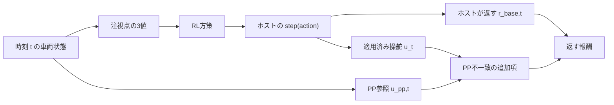

# 仕組みと数式

この追加モジュールは、既存のMetaDrive環境から返る状態に道路の少し先を表す3値を加えて学習できるようにします。別のモードでは、その同じ先の点から計算したPure Pursuit（PP）の操舵を参考値として使い、実際に適用された操舵との違いだけを追加報酬にします。

このチェックアウトで現在確認できるホストの生観測は `(259,)` です。ここで説明する対応ホストの前提は、開始レーンの意味を監査した `(262,)` `float32` 観測であり、259次元に合わせるpaddingはしません。従って現在は、以下の式を実ホストの265次元PPO結果として解釈できる状態ではありません。

## 入力と報酬の流れ

方策が見る入力と、報酬を計算する参照値は別の流れです。

全モードで行動空間と物理遷移は同じです。PPはRL方策の出力を上書きせず、PPの値を観測へ追加もしません。

| canonical mode | 方策への入力 | 返す報酬 |
|---|---|---|
| `baseline`（基準環境） | 既存の262値 | `r_base` |
| `lookahead_obs`（前方注視点入力） | 既存の262値＋注視点3値＝265値 | `r_base` |
| `lookahead_obs_pp_reward`（前方注視点入力＋PP参照報酬） | `lookahead_obs` と同じ265値 | `r_base + r_pp` |

## 観測の契約

対応するホストの生観測は、1次元の `float32` ベクトル $o_t^{\rm host}\in\mathbb{R}^{262}$ です。意味を確認した既存の接頭辞は値と順序をそのまま保持し、再正規化・padding・切り捨てをしません。対応ホストで開始レーンに関係する既存の3値は `259, 260, 261` にあります。

追加モードでは、次の3値を末尾に追加します。

| インデックス | 値 | 意味 |
|---:|---|---|
| `262` | `x_norm` | 車体から見た注視点の前後方向 |
| `263` | `y_norm` | 車体から見た注視点の左右方向 |
| `264` | `preview_valid` | 注視点が有効なら `1.0`、無効なら `0.0` |

追加後も配列は `float32` で、形状は `(265,)` です。従って2つの追加モードの観測は同一です。

例えば、まっすぐな道路の開始点で車体が $p=(0,0)$、向きが前向きなら、6 m先の点は $q=(6,0)$ なので $(x_g,y_g)=(6,0)$、追加値は
$$
  (x_{\rm norm},y_{\rm norm},preview\_valid)=(0.8,0.5,1.0)
$$
です。無効時は常に $(0.5,0.5,0.0)$ を使います。これは欠測を表す有限な値です。実際の左右差が0 mのときも正規化後は0.5なので、無効値の0.5を左右差0と解釈せず `preview_valid` を一緒に見ます。

## 注視点の求め方

### reset時に固定する経路

wrapperの `LookaheadEnv.reset` 内で基底環境の `reset` が返った後、開始レーンの情報とNavigationの計画済みチェックポイントから順序付きの固定経路を一度作ります。経路を累積距離でパラメータ化した有限曲線として
$$
  P(S),\qquad 0\leq S\leq S_{\rm end}
$$
と書きます。ここで $S$ はレーンをまたいでも続く弧長（道路に沿った距離）です。隣のレーンを推測するのではなく、reset時に保存した開始レーンの順序と計画された有向道路を使います。

採用できるのは、長さが有限で `StraightLane` または `CircularLane` として検証できる区間です。レーンの接続点、接線、レーン数、幅も確認します。不連続・未対応・曖昧な区間に達したら、そこまでの検証済みprefixと境界理由を保持し、先の道路を作り足しません。経路終端や未検証境界の先は外挿しません。

### 投影と6 m先

現在の車体位置を
$$
  p=\texttt{vehicle.position}
$$
とします。固定経路上へ $p$ を投影して得る累積距離を $S_{\rm proj}$ とし、注視距離を6 mとして
$$
  S_{\rm goal}=S_{\rm proj}+6.0,\qquad q=P(S_{\rm goal})
$$
とします。6 mはユークリッド距離（弦の長さ）ではなく、経路に沿った弧長です。

投影では固定経路の各有限レーン区間を調べ、区間内の最も近い候補を使います。有限区間の投影のために端点候補を
使うことはありますが、開始レーンを別の最近傍レーンへ変更するfallbackではありません。開始レーンの参照が失われた場合は無効にします。

$S_{\rm goal}>S_{\rm end}$ になったとき、$q$ を終点へclampしたり、6 mを短くしたりしません。経路終端や未検証prefixの境界を越える場合は無効です。

### 車体座標と正規化

車体の向きを $\psi$ とし、車体の前向き・左向き単位ベクトルを
$$
  f=(\cos\psi,\sin\psi),\qquad
  \ell=(-\sin\psi,\cos\psi)
$$
とします。左が正の $y$ です。$\Delta=q-p$ とおくと、注視点の車体座標は
$$
  x_g=\Delta\cdot f,\qquad y_g=\Delta\cdot\ell.
$$
この $x_g,y_g$ はclamp前のメートル単位の診断値として保持し、観測へ入れるときだけ10 mを基準に
$$
  n(v)=\frac{\operatorname{clip}(v/10.0,-1,1)+1}{2},
  \qquad (x_{\rm norm},y_{\rm norm})=(n(x_g),n(y_g))
$$
で変換します。従って $-10$ m以下は0、0 mは0.5、10 m以上は1になります。

無効になる主な条件は、固定経路・投影・注視点が得られない、接続境界を越える、開始レーン参照がない、注視点が車体の前にない、または位置・向きが有限でない場合です。前向き速度が $-0.1\,\mathrm{m/s}$ 未満の逆走も無効ですが、停止や低速（例えば0 m/s）はそれだけでは無効にしません。無効時も、先の道路へのendpoint clampや開始レーンから最近傍レーンへの変更は行いません。

## PP操舵参照

PPは有効な注視点 $q$ と同じ $q$ を使います。車体位置から後輪車軸までの距離を $L_r$ とすると、後輪位置と後輪座標は
$$
  p_r=p-L_r f,\qquad x_r=x_g+L_r,\qquad y_r=y_g
$$
です。監査した `DefaultVehicle` の値は、ホイールベース $L=2.46894\,\mathrm{m}$、後輪までの距離
$L_r=1.4166\,\mathrm{m}$、最大操舵角 $\texttt{max\_steering\_deg}=40$ 度です。正規化操舵の符号は、ソースと操舵pulseの確認に基づき `steering_sign=+1` とします。

後輪座標から曲率、操舵角、正規化操舵を順に計算します。
$$
  \kappa=\frac{2y_r}{x_r^2+y_r^2},\qquad
  \delta=\operatorname{atan}(L\kappa),
$$
$$
  u_{\rm pp}^{\rm raw}=\frac{\texttt{steering\_sign}\,\operatorname{deg}(\delta)}{\texttt{max\_steering\_deg}},
  \qquad u_{\rm pp}=\operatorname{clip}(u_{\rm pp}^{\rm raw},-1,1).
$$
分母の監査値は `max_steering_deg=40` です。`lookahead_obs_pp_reward` の起動時には、`DefaultVehicle` の車体寸法、最大操舵角、`EnvInputPolicy` の経路を検査し、操舵符号の設定には `steering_sign=+1` のみを受け付けます。符号 `+1` はこのホストでの監査結果です。実際の符号を測定するのは別の診断コマンド `doctor --probe --pulse` であり、通常の学習起動時には再測定しません。移植先でもこの診断で操舵符号を確認する必要があります。これらの起動条件は、状態ごとのPP無効判定とは別です。起動後に注視点が無効、後輪形状が取得できない、距離の分母が小さすぎる、値が有限でないといった状態依存の条件なら `pp_valid=false` として追加報酬のマスクを0にします。PPが飽和したかどうかも診断値として残します。

検証済みの離散設定ではRLの操舵値 $u_t$ は $\{-1,0,1\}$ から選ばれます。一方、$u_{\rm pp}$ は連続値のままです。
例えば $u_{\rm pp}=0.1$ なら0の操舵は $\lvert0-0.1\rvert$ が最小ですが、PPに最も近い離散行動を強制する処理ではありません。
報酬の比較を通じて0方向を好みやすくなるバイアスとして理解します。

## 追加報酬と1 decision

`LookaheadEnv` は、`reset` で初期状態 $s_0$ のsnapshotを作り、`step`ごとに次の順で動きます。

1. pre-action snapshotの $q$、`preview_valid`、`pp_valid` を保持したまま、ホストの `env.step(action)` を1回だけ呼びます。
2. ホストがデコード・clipして実際に適用した現在の操舵 $u_t=\texttt{vehicle.current\_action[0]}$ を読みます。方策の生出力ではありません。
3. ホストの `step` が返した値そのものを $r_{\rm base,t}$ とします。`info` の `step_reward` を再計算したり代用したりしません。
4. post-action snapshotを作り、次の観測にはpost-action側の注視点3値を付けます。

PP参照報酬を付ける場合のマスクと誤差は、pre-actionの参照に対して
$$
  m_t=\mathbf{1}[\text{pre-actionの }pp\_valid]
      \mathbf{1}[\neg terminated_{t+1}]
      \mathbf{1}[\neg truncated_{t+1}],
  \qquad e_{\rm pp,t}=\frac{\lvert u_t-u_{\rm pp,t}\rvert}{2}
$$
です。追加項と返す報酬は
$$
  r_{\rm pp,t}=-w\,\Delta t\,m_t\,e_{\rm pp,t},
  \qquad r_t=r_{\rm base,t}+r_{\rm pp,t}.
$$
注視点またはPPが無効ならマスクは0です。終了step（`terminated` または `truncated`）もマスクして $r_{\rm pp,t}=0$ とするため、ホストの終端報酬を保ちます。判定は行動前の参照で行い、行動後のsnapshotが無効になっても、行動前が有効だったそのstepの追加項を消しません。基準環境と注視点入力モードでは常に $r_t=r_{\rm base,t}$ です。

数値例として $u_t=0.3$、$u_{\rm pp,t}=0.1$、$\Delta t=0.1$、$w=1$ なら、
$$
  e_{\rm pp,t}=0.1,\qquad r_{\rm pp,t}=-1\times0.1\times0.1=-0.01.
$$
$w=0$ は注視点入力モードとの観測・報酬・物理状態の一致を確認する等価性チェックに使えます。$w=0.1$ は暫定的なsmoke確認値であり、
性能上の推奨値ではありません。実験で使う重みは、同じseed・設定で明示して記録します。

$\Delta t$ は固定値をコードに埋め込まず、ホスト設定から
$$
  \Delta t=\texttt{physics\_world\_step\_size}\times\texttt{decision\_repeat}
$$
として読みます。現在の公式設定なら $0.02\times5=0.1$ 秒ですが、別設定ではその実値を使います。適用済み操舵の履歴、操舵差分、操舵率、yaw rateはログ用であり、
観測やPP追加報酬の入力として別に加算しません。

## ログと評価値の読み方

各stepの有効性、pre/postの状態、$u_t$、$u_{\rm pp,t}$、`e_pp`、基本報酬、追加報酬、経路投影などを保持します。`preview_valid` と `pp_valid` は別々に数え、
無効値や欠測区間は0で埋めず、そのまま件数・区間として残します。

ふらつきの評価では、同じ区間・同じseedの系列をそろえ、各stepの有効な継続時間 $\Delta t_i$ で重み付けして次を見ます。

| 指標 | 平易な意味 | 代表的な式 |
|---|---|---|
| RMS | 誤差や変化量の典型的な大きさ | lateralは $\sqrt{\sum_i e_i^2\Delta t_i/\sum_i\Delta t_i}$ |
| p95 | 大きな外れや一時的な振れ | $\lvert e_i\rvert$ を $\Delta t_i$ で重み付けした95%境界 |
| TV/s | 1秒あたりの操舵の総変化。小刻みな左右切替 | $\sum_i\lvert u_i-u_{i-1}\rvert/\sum_i\Delta t_i$ |
| rate RMS | 操舵がどれだけ急に変わったか | $\sqrt{\sum_i((u_i-u_{i-1})/\Delta t_i)^2\Delta t_i/\sum_i\Delta t_i}$ |

平均速度（`speed_mean_mps`）と進行量毎秒（`progress_per_s`）の低下が5%を超えないか、完了時間（`completion_time_s_mean`）の増加が5%を超えないかを先に確認する暫定ガードも記録します（候補値が速度・進捗で基準の0.95未満、完了時間で基準の1.05超にならないかを見る）。この5%は暫定の比較条件で、改善の証明ではありません。未完了episodeは `incomplete` として残し、完了時間を成功値として補いません。欠損や有効分母のない値は `None` と件数・区間を残し、欠損を良い結果として扱ったりmatched区間を黙って削ったりしません。テストの262次元は合成環境による契約確認、raw診断はホストの観測確認です。実ホストの262次元観測から265次元を作るPPO学習・評価はまだ実行していないため、ふらつきや性能の改善を主張できる段階ではありません。

## 実装との対応

式の実装場所を追うときは、次の入口から読みます。

| 役割 | 関数・クラス | ソース |
|---|---|---|
| raw観測契約、末尾3値、無効値 | `ObservationContract`, `normalize_preview_coordinate`, `invalid_preview_values` | [`adapter.py`](../adapter.py) |
| 開始レーンから固定経路を作る | `build_fixed_navigation_route` | [`adapter.py`](../adapter.py) |
| 経路、投影、注視点の幾何 | `build_reference_route`, `project_to_path`, `compute_preview` | [`geometry.py`](../geometry.py) |
| reset/stepとpre/post snapshot | `LookaheadEnv.reset`, `LookaheadEnv.step`, `LookaheadEnv._make_snapshot` | [`env.py`](../env.py) |
| PPと追加報酬 | `compute_pure_pursuit`, `pp_penalty_result` | [`geometry.py`](../geometry.py) |
| MetaDrive状態から各providerを組み立てる | `MetaDrivePreviewProvider`, `MetaDrivePPProvider` | [`runner.py`](../runner.py) |

実行前の診断と学習・評価コマンドは[実行手順](run.md)、別ホストへの配置は[移植・コピー手順](porting.md)、3モードの全体像と現在の前提は[ドキュメントREADME](README.md)を参照してください。
