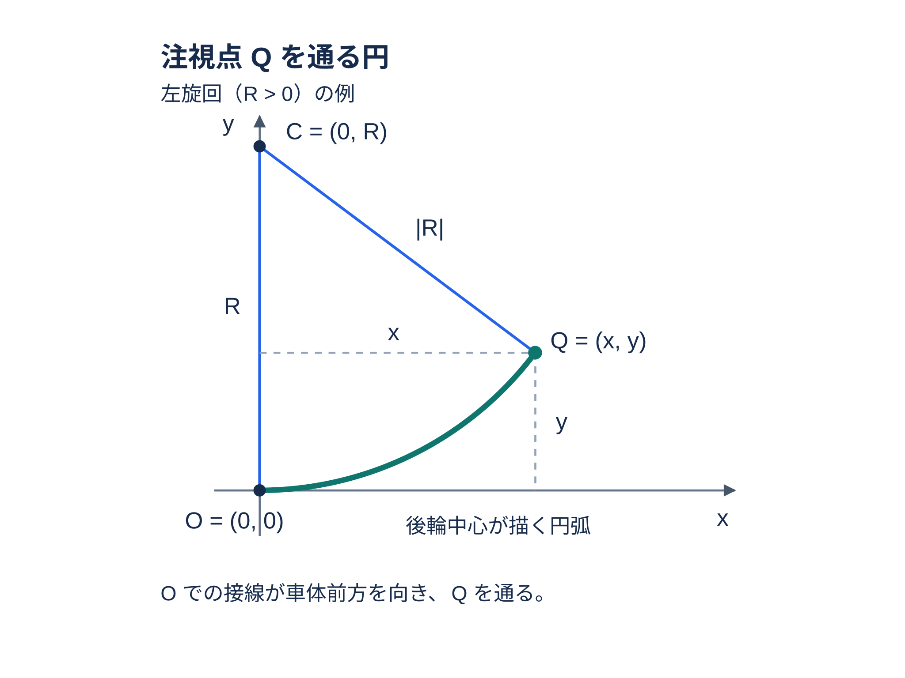
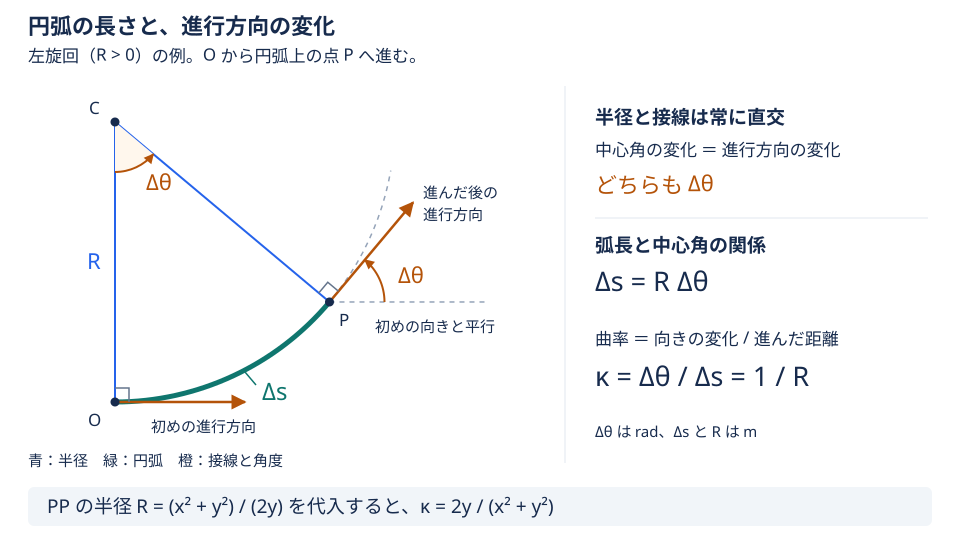
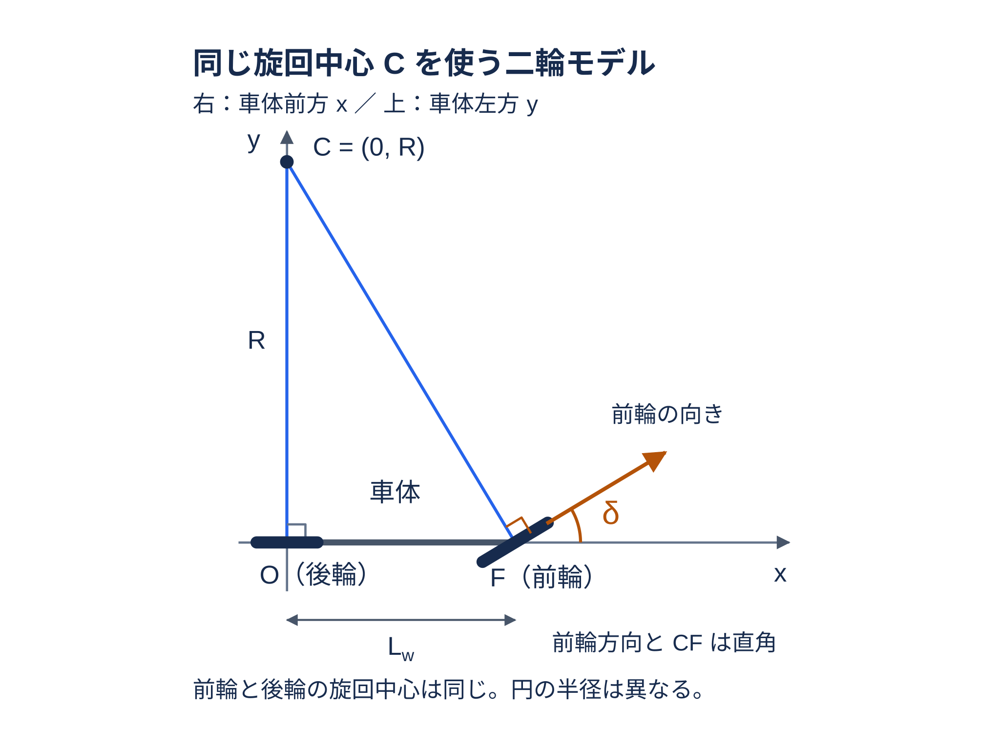

# Pure Pursuit の幾何式の導出

この文書では、`lookahead_learning` が pre-action の注視点から計算する
Pure Pursuit（PP）参照のうち、曲率と前輪操舵角の 2 式を導出します。
対象は [methods.md の 2.2 節](methods.md) にある実装です。PP は Action を
置き換える制御器ではなく、注視点へ向かう理想的な操舵を比較用の参照として
作る幾何計算です。

## 記号と実装の座標

以下では、1 つの pre-action 状態だけを扱うため、行動ステップの添字 $t$ を
省きます。本文の各量は、同じ pre-action 状態における値として読んでください。

preview が作った world 座標の注視点を $q$ [m] とします。$q$ は、車体基準点の
経路への投影位置から固定経路に沿って lookahead 距離 $L_d$ [m] だけ進んだ同じ注視点です。
$L_d$ は経路に沿う
弧長であり、後輪から注視点までの直線距離や、後で分母に現れる距離とは別の量です。

車体基準点の world 座標を $p$ [m]、車体 heading を $\psi$ [rad] とします。
world 座標での車体前方と左方の単位ベクトルを、それぞれ $\mathbf f$ と
$\mathbf l$ と定義します。

$$
\mathbf f=(\cos\psi,\sin\psi),
\qquad
\mathbf l=(-\sin\psi,\cos\psi).
$$

車体基準点から後輪車軸までの後方距離を $d_r$ [m]、同じ基準点から前輪車軸
までの前方距離を $d_f$ [m] とします。前後の車軸間距離（wheelbase）を
$L_w$ [m] と定義すると、

$$
L_w=d_f+d_r.
$$

後輪車軸の world 座標を $p_{\mathrm{rear}}$ [m] とします。実装では、
`REAR_WHEELBASE` を $d_r$ として車体基準点から前方ベクトル $\mathbf f$ の
逆向きへ移します。

$$
p_{\mathrm{rear}}=p-d_r\mathbf f.
$$

後輪車軸から注視点までの world 座標差を
$\boldsymbol\Delta_{\mathrm{rear}}=q-p_{\mathrm{rear}}$ [m] と定義します。
内積を $\cdot$ と書き、後輪車軸を原点、車体前方を正の $x$ 軸、車体左方を正の
$y$ 軸とする成分を $x$ [m]、$y$ [m] とします。

$$
\begin{aligned}
x&=\boldsymbol\Delta_{\mathrm{rear}}\cdot\mathbf f,\\
y&=\boldsymbol\Delta_{\mathrm{rear}}\cdot\mathbf l.
\end{aligned}
$$

この $x,y$ は観測に入れる前のメートル単位の座標です。観測用の clip・正規化後の
値は、この PP 計算の入力ではありません。

## 注視点を通る円と曲率

ここでは、理想的な前輪操舵の二輪モデル（bicycle model）を仮定します。左右の前輪を
1 輪、左右の後輪を 1 輪にまとめたモデルで、タイヤの横滑りはないものとします。
現在の後輪車軸の接線方向は車体前方（正の $x$ 方向）です。PP はこの接線を
後輪車軸で保ち、後輪車軸と注視点を同じ円上に置く円弧を参照として選びます。
この円は実車の動力学的な軌跡そのものではなく、注視点から作る参照幾何です。

後輪車軸を $O=(0,0)$ [m] とします。円の接線と半径は直交するため、
$O$ での接線が $x$ 軸に沿うなら、円の中心は $y$ 軸上にあります。
符号付き半径を $R$ [m] とし、円の中心を

$$
C=(0,R)
$$

と置きます。$R>0$ なら中心は車体左側にあり左旋回、$R<0$ なら中心は車体右側に
あり右旋回です。どちらの場合も実際の半径の大きさは $|R|$ [m] です。

図中の注視点を $Q=(x,y)$ [m] とします。図は左旋回の例です。後輪車軸を原点とし、
$x$ 軸を前方（右向き）、$y$ 軸を左方（上向き）に置きます。

後輪座標で表した注視点 $Q=(x,y)$ [m] がこの円上にある条件は、円の半径が
$|R|$ であることから、

$$
x^2+(y-R)^2=R^2
$$

です。展開して整理すると、

$$
x^2+y^2-2Ry=0
$$

となります。$y\ne0$ の場合は、これを $R$ について解いて、

$$
R=\frac{x^2+y^2}{2y}
$$

を得ます。

ここまでで、注視点を通る円の符号付き半径 $R$ が求まりました。次に、この円に
沿って進むときの曲率 $\kappa$ [1/m] を求めます。

曲率は、進んだ距離に対して進行方向がどれだけ変わるかを表す量です。円弧に沿って
前進した長さを $\Delta s>0$ [m]、その間の進行方向の変化量を $\Delta\theta$ [rad]
とし、左への回転を正とします。円弧上では曲率が一定なので、

$$
\kappa=\frac{\Delta\theta}{\Delta s}
$$

と表せます。次の図は左旋回の例で、後輪車軸が $O$ から円弧上の点 $P$ まで進む
場合を示します。緑の円弧の長さが $\Delta s$、橙の矢印が各点での進行方向です。

円に沿う進行方向は接線方向であり、接線と半径は常に直交します。そのため、
進行方向が $\Delta\theta$ だけ変わると、半径の向きも同じ角度だけ変わります。
図の中心 $C$ と点 $P$ に描いた角度がともに $\Delta\theta$ なのは、このためです。

したがって、$\Delta\theta$ は符号付き中心角の変化量でもあります。円の弧長と
中心角の関係を、符号付き半径 $R$ を使って表すと、

$$
\Delta s=R\,\Delta\theta
$$

です。右旋回では $R$ と $\Delta\theta$ がともに負になるため、$\Delta s$ は正に
なります。この関係を曲率の式に代入すると、

$$
\kappa=\frac{\Delta\theta}{R\,\Delta\theta}=\frac{1}{R}
$$

を得ます。先ほど求めた $R=(x^2+y^2)/(2y)$ を代入すると、

$$
\boxed{\displaystyle
\kappa=\frac{2y}{x^2+y^2}}
$$

です。したがって $y>0$ なら $\kappa>0$、$y<0$ なら $\kappa<0$ となり、
車体左方を正とした座標の左右差がそのまま曲率の符号になります。
この「後輪の接線と注視点を通る円」を使う PP の円幾何は、
[Coulter, *Implementation of the Pure Pursuit Path Tracking Algorithm*, §2](https://publications.ri.cmu.edu/storage/publications/pub_files/pub3/coulter_r_craig_1992_1/coulter_r_craig_1992_1.pdf)
にも説明されています。本書の軸向きと $L_d$ の定義は、このソースの規約に合わせています。

$y=0$ かつ $x^2+y^2>0$ の場合、注視点は前後軸上にあります。これは半径が無限大に
なる直進の極限なので、$\kappa=0$ とします。先ほどの枠で囲んだ式にもその値が現れます。
$x=y=0$ では円を決める距離がなく、分母を 0 にしてはいけません。

## 二輪モデルから操舵角へ

円周率を $\pi$ とします。前輪操舵角を $\delta$ [rad] とします。$\delta$ は前輪の向きが車体前方から
左へ回った角度を正とする符号付き角度です。

ここでは前進する場合を考え、前輪の進行方向を車体前方の成分が正になる向きに
選びます。前輪の進行方向の単位ベクトルの前方成分は $\cos\delta$ なので、
この条件は $\cos\delta>0$ です。この向きを一意に表すため、操舵角 $\delta$ の
範囲を $-\pi/2<\delta<\pi/2$ とします。

後輪座標で前輪車軸中心を

$$
F=(L_w,0)
$$

と書きます。前輪車軸中心 $F$ は後輪車軸の円そのものには乗りません。横滑りが
ない剛体の二輪モデルでは、前輪車軸も同じ瞬間中心 $C$ のまわりを動くため、
前輪の進行方向はその半径に垂直な接線になります。

次の図は左旋回の例です。後輪車軸を原点とし、$x$ 軸を前方（右向き）、
$y$ 軸を左方（上向き）に置き、旋回中心 $C$、前輪車軸中心 $F$、操舵角 $\delta$
の関係を示します。

前輪の進行方向（接線）の単位ベクトルを $(\cos\delta,\sin\delta)$ とします。
$C$ から前輪車軸中心 $F$ へ向かう半径ベクトルは $F-C=(L_w,-R)$ なので、接線と
半径が直交する条件は、

$$
(L_w,-R)\cdot(\cos\delta,\sin\delta)=0
$$

です。内積を展開すると、

$$
L_w\cos\delta-R\sin\delta=0
$$

となります。前述の向きの選び方から $\cos\delta>0$ なので、両辺を整理して

$$
\tan\delta=\frac{L_w}{R}=L_w\kappa
$$

を得ます。直進は、旋回半径の大きさ $|R|$ が無限大になる極限に対応します。
このとき $L_w/R\to0$ なので、上の関係から操舵角も $\delta\to0$ となります。

選んだ角度範囲では、正接の値から操舵角が一意に決まります。正接の逆関数を
$\arctan$ と書けば、実装する操舵角は

$$
\boxed{\displaystyle
\delta=\arctan(L_w\kappa)}
$$

となります。$\arctan$ は $(-\pi/2,\pi/2)$ [rad] の範囲を返す逆正接関数で、
入力の $L_w\kappa$ は無次元量です。実装の `math.atan` は角度を rad で返します。
この後輪車軸を原点と
する二輪モデルの関係 $R=L_w/\tan\delta$ は、
[LaValle, *Planning Algorithms*, §13.1.2](https://msl.cs.uiuc.edu/planning/ch13.pdf#page=6)
の simple car の幾何とも対応します。

## 実装との対応と境界

`MetaDrivePPProvider` は、preview の有効な同じ $q$、車体基準点 `p_xy`、heading
`psi_rad` を使います。[adapter.py](../adapter.py) で次の値を作り、
[geometry.py](../geometry.py) の `pure_pursuit_from_rear_coordinates` へ渡します。
`compute_pp_reference` は
同じ PP 計算を行う `compute_pure_pursuit` の別名です。

| 導出の量 | 実装上の値 | 意味・単位 |
|---|---|---|
| $q$ | `preview.q_xy` | pre-action の注視点、world 座標 [m] |
| $d_r$ | `rear_wheelbase_m` | `REAR_WHEELBASE`、基準点から後輪まで [m] |
| $L_w$ | `wheelbase_m` | `FRONT_WHEELBASE + REAR_WHEELBASE`、前後車軸間 [m] |
| $x,y$ | `x_rear`, `y_rear` | 後輪座標での注視点 [m] |
| $\kappa$ | `kappa_pp` | 符号付き曲率 [1/m] |
| $\delta$ | `delta_pp_rad` | PP 前輪操舵角 [rad] |

曲率の符号はこの幾何式の段階では変更しません。実装の `steering_sign` は、rad の
$\delta$ を度へ変換して最大操舵角で正規化する段階で、既存環境の操舵方向に合わせて
符号を掛けます。したがって、`steering_sign = -1` でも円から求める $\kappa$ と
$\delta$ の導出は同じです。`u_pp` への度変換・clip・正規化の詳細は
[methods.md の 2.2 節](methods.md) を参照してください。

コードは分母 $x^2+y^2$ [$\mathrm{m}^2$] を調べ、この値が

$$
x^2+y^2\leq 10^{-6}\,\mathrm{m}^2
$$

なら `rear_goal_distance_too_small` として PP 参照を無効にし、$\kappa$ や
$\delta$ を計算しません。この判定がゼロ除算と、極端に小さい距離での数値的不安定を
防ぎます。それ以外では、有限な $x,y$ と正の有限な $L_w$ などを検証したうえで、
上の 2 つの枠で囲んだ式を順に評価します。
