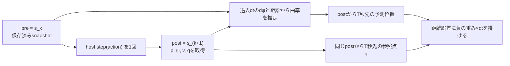

# 時間指定の注視点と等速予測位置報酬

実装: `adapter.py:MetaDrivePreviewProvider` → `geometry.py:compute_preview` →
`env.py:LookaheadEnv.step` → `prediction.py:prediction_penalty`。
機能1は「何秒先の道を見るか」、機能2は「今の速さと曲がり方を続けた位置が、その道の点から何mずれるか」を表します。
機能2は予測位置の誤差をそのstepで採点します。未来の実測値を待ちません。

## 1. 共通の座標・時刻

位置は既存previewと同じ車体中心のワールド座標[m]、向きψはrad、速さvは平面速度の大きさ[m/s]です。
局所座標はxが前、yが左で、正の曲率は左旋回です。後輪中心は既存PPだけで使います。



`dt = physics_world_step_size * decision_repeat`、予測対象時刻は `post.t_seconds + T`。
`pre`は曲率推定のためだけに使います。既存PPはpreの参照点、既存必要横加速度報酬はpreの経路区間とpost速度という従来の時刻契約を維持します。

単位の根拠は、この環境のMetaDriveソース `metadrive/base_class/base_object.py` の
`position`、`heading_theta`、`velocity`、`speed` と、`envs/base_env.py` のstepです。
`velocity[:2]`はm/s、`speed`もその平面ノルム（host側のclampあり）、`speed_km_h`は別APIです。
時間指定ではadapterが **velocityのノルム** を使い、後退判定には別に
`vx*cos(ψ) + vy*sin(ψ)` を使います。正規化観測やkm/hをそのまま使いません。
別hostではこのソース契約を確認し、必要ならadapterで明示的に単位変換します。

## 2. 機能1: 時間から注視距離を求める

目標車線の固定中心線をP(S)、車体中心の投影をS_projとすると、

```text
L = v * T
q = P(S_proj + L)
```

`MetaDrivePreviewProvider.__call__` がLを既存 `compute_preview(..., lookahead_m=L)` に渡します。
開始車線、reset時の参照経路、投影、後退・前方・境界判定は従来の処理です。
経路を探索し直さず、Lの下限・上限、終端clamp、外挿、別車線への置換は追加しません。
停止でL=0になり前方条件を満たさない場合も従来の無効値になります。
previewの既存後退判定は符号付き前進速度 `< -0.1m/s` です。

観測はraw幅Dに既存の3値だけを追加します。

```text
[raw..., 0.5*(clip(x_g/10, -1, 1)+1), 0.5*(clip(y_g/10, -1, 1)+1), b]
無効時の末尾 = [0.5, 0.5, 0.0]
```

時間指定でも10mの正規化式は変えません。飽和率を記録するだけで、TやLを自動調整しません。
報酬は未クリップのワールド座標から求めます。

## 3. 機能2: 曲率・予測位置・報酬

数式は `prediction.py` に集約しています。`MotionState` は有限の座標・向き・平面速度・符号付き前進速度を検証します。

```text
dpsi = wrap_to_pi(psi_post - psi_pre)
ds_hist = 0.5 * (v_pre + v_post) * dt
kappa_hat = dpsi / ds_hist

D = v_post * T
alpha = kappa_hat * D
x_local = D * sin(alpha)/alpha
y_local = D * (1-cos(alpha))/alpha
p_hat = p_post + R(psi_post) @ [x_local, y_local]

e_pos_m = norm(p_hat - q_post)
r_prediction = -prediction_reward_weight * dt * e_pos_m / prediction_error_scale_m
r_total = r_base + r_pp + r_lateral_accel + r_prediction
```

`ds_hist`は過去dt区間の距離の台形近似です。2時点の速度から加速度は計算せず、未来はv_postとkappa_hatを一定とします。
`kappa_hat`を経路・PP・操舵モデルの曲率で置換せず、平滑化・曲率クリップもしません。
`abs(alpha)<1e-4`では級数、それ以外のcoscでは `2*sin(alpha/2)^2/alpha` を使い、0近傍を安定に評価します。
NumPyのπを含むsincは使いません。掛ける時間は **dtでありTではありません**。

例えばv=10m/s、T=1s、直線中心なら予測位置と参照点が一致します。
同じ方向へ車線中心から1m平行にずれて走る場合は誤差1mです。
w=0.1、dt=0.1s、scale=1mなら新項は `-0.01`。
横ずれ12mが観測で飽和しても、報酬計算には12mを使います。

横滑りを無視して車体の向きを進行方向とみなす近似です。
実際の将来行動・将来軌跡は予測しません。仮想step、行動補正、追加観測、加速度推定・加速度付き予測はありません。

## 4. 設定とモデル互換

```toml
[lookahead]
lookahead_m = 6.0
lookahead_time_s = 1.0
pp_weight = 0.0
lateral_accel_reward_enabled = false
prediction_reward_enabled = true
prediction_reward_weight = 0.1
prediction_error_scale_m = 1.0
```

T指定時は **時間優先でlookahead_mは未使用**。T省略は従来の距離指定です。
T/scaleは正の有限値、weightは0以上の有限値、enabledは厳密なbool。
未知キー、数値欄のbool、NaN/Infは拒否します。内部の解決済みmappingではT省略をNoneで表します。
実効Onは `enabled and weight > 0` で、時間指定が必須です。
省略時はOff。Off/weight=0では新項を計算・加算せず、新項だけのhost APIを要求しません。
時間指定自体は速度・位置・向き・後退判定を必要とします。
T=1s、weight=0.1、scale=1mは検証用初期値で、最適値ではありません。

`checkpoint.py` のZIP属性schemaは3です（実験TOMLのroot schema_version=2とは別）。
旧schema1は距離指定・横加速度報酬Off・予測報酬Off、旧schema2は距離指定・予測報酬Offとして読み取ります。
旧ZIPを書き換えず、sidecarは増やしません。未知schemaを拒否します。
同じD+3でも距離/時間、距離値またはT、PP、実効Onの各報酬設定が異なるモデルは拒否します。
時間指定時の未使用lookahead_m、実効Offのweight/scaleは照合対象から除外します（値の型・範囲は検証）。

## 5. マスクとエラー

| 状況 | 新項・理由 | 注視点観測 |
|---|---|---|
| reset | 0 / reset（実効On時） | resetのpreviewを使用 |
| Off / 重み0 | 0 / disabled, zero_weight | 機能1のみと同じ |
| terminated / truncated | 0 / episode_end | terminal snapshot |
| 履歴不足 | 0 / history_unavailable | 有効なら維持 |
| post preview無効 | 0 / preview_invalid、幾何理由も保存 | 従来の無効表現 |
| preまたはpostの符号付き前進速度が負 | 0 / reverse_motion | 有効なら維持 |
| v_post ≤ 0.1m/s | 0 / low_speed | 有効なら維持 |
| ds_hist ≤ 1e-4m | 0 / insufficient_history_distance | 有効なら維持 |

閾値は `MIN_PREDICTION_SPEED_MPS` と `MIN_HISTORY_DISTANCE_M`。Lの下限ではありません。
予測不能な曲率・誤差はNoneです。0曲率として直進予測に置換しません。
reset snapshotがpreになるので、最初のstepも条件を満たせば計算します。episodeを跨ぐ履歴はありません。
SB3の自動resetは外側に置きます。内側の同時resetを示すfinal_observation/final_obsはエラーにします。

必須状態・単位の欠落、非有限値、dt変化などは `HostContractError` として失敗します。
通常の低速・経路境界とは区別し、広い例外捕捉で無効状態に丸めません。
独自state_readerは `position_xy`、`heading_theta`、`speed_m_s`、`forward_speed_mps`、
`speed_unit="m/s"`、`speed_meaning="planar magnitude"` を返してください。
独自preview_providerも同じpostの時間指定qを返す必要があります。

## 6. ログと比較

既存 `info["lookahead_learning"]` がそのままstep JSONLへ保存されます。
既存 `q`、`x_g`、`S_proj` 等はpre参照のままです。
post参照は `prediction_goal_xy` と `prediction.goal_xy` で区別します。

| 保存先 | 主な値・用途 |
|---|---|
| namespace直下 | lookahead_time_s、lookahead_mode、lookahead_priority、effective_lookahead_m（postのL） |
| prediction | origin_time_s、target_time_s、time_s、goal_xy、predicted_xy、dpsi_rad、ds_hist_m、kappa_hat_inv_m、distance_m、alpha_rad、error_m、reward、valid、skip_reason、weight、error_scale_m、dt_seconds |
| pre_step / post_step | 車体中心・向き・速度・符号付き前進速度とpreview（再計算用） |
| reward分解 | r_base、r_pp、r_lateral_accel、r_prediction、r_total、およびepisode_r_* |
| prediction_episode | evaluated_seconds、invalid_seconds、skipped_seconds、reason_seconds、valid_time_ratio、観測件数・飽和件数・飽和率 |

有効率の分母は evaluated_seconds + invalid_seconds。Off/重み0/terminalはskipped_secondsに分離します。
分母0はNoneです。resetは時間集計に入りません。
飽和率の分母は **resetを含む、実際に返した有効preview観測件数**。
x/yのどちらかが10m範囲を超えた観測を1件と数えます。無効previewを分母に含めません。

3条件は同じ学習・環境・評価seedで比較し、定義の異なるr_totalだけで優劣を判断しません。
既存出力のmean_speed_m_s、成功/到着/道路外/衝突/時間切れ、stepのprogress_delta_mまたはS_proj_delta_m、
lateral_error_m、du、steering_rate、prediction_episode.valid_time_ratio、停止・低速マスク時間を確認します。
速度維持、事前減速、ふらつき抑制、最適方策不変性は保証しません。停止・低速化による新項回避も評価対象です。
既存の進捗・車線維持・終了ペナルティは保持します。

## 7. 検証範囲

同梱 `test_prediction.py` は標準ライブラリの数値・設定・旧モデル互換テストです。
`test_prediction_env.py` は実providerを使うfake hostの時刻・合算・マスク・乱数・Monitorテストです。
`test_portability.py` はPORTABLE_FILESだけのコピーとimport禁止で依存閉包を確認します。
実行結果・実環境smoke・未検証事項は [READMEの検証記録](README.md#検証記録) を参照してください。
学習性能の改善や別PCでの実移植の完了を、これらのテストから主張するものではありません。
