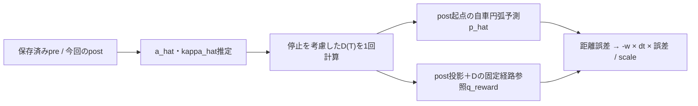

# 時間指定の注視点と等速／等加速度の予測位置報酬

実装: `adapter.py:MetaDrivePreviewProvider` → `geometry.py:compute_preview` →
`env.py:LookaheadEnv.step` → `prediction.py:prediction_penalty`。
機能1は「何秒先の道を見るか」、機能2は「今の速さと曲がり方を続けた位置が、その道の点から何mずれるか」を表します。
機能3は直近1stepの速さの増減も続くと仮定する方式です。機能2と3は同じ位置報酬の方式を切り替えます。
予測位置の誤差をそのstepで採点し、未来の実測値を待ちません。入力に加速度は追加しません。

## 1. 共通の座標・時刻

位置は既存previewと同じ車体中心のワールド座標[m]、向きψはrad、速さvは平面速度の大きさ[m/s]です。
局所座標はxが前、yが左で、正の曲率は左旋回です。後輪中心は既存PPだけで使います。

以下の記号を使います。初速は発進時の速度ではなく、**予測起点post時点の速さ**です。
D(T)は予測中に進む道のりであり、直線変位や位置誤差ではありません。

| 記号 | 意味・基準 | 単位 |
|---|---|---|
| pre / post | 同一episodeの今回の行動の直前／直後。postが予測起点 | — |
| Δt（コードのdt） | preからpostまでの1 decision step。physics_world_step_size × decision_repeat | s |
| T | postからの予測時間。既存lookahead_time_s | s |
| v_pre / v_post | pre／postの平面速度の大きさ。後退判定用の符号付き前進速度とは別 | m/s |
| ψ_pre / ψ_post | 車体の向き。前輪操舵角ではない | rad |
| p_post | postの車体中心、ワールド2次元座標 | m |
| a_hat | 直近区間の平均接線加速度。速さの増減 | m/s² |
| dψ / ds_hist | 直近区間のwrap済み向き差／台形近似の道のり | rad / m |
| κ_hat | 挙動から推定する曲率。正は左旋回 | 1/m |
| D(T) | postからT秒間の予測道のり（以降Dとも表記） | m |
| T_stop / τ（tau） | 減速継続時の停止までの時間／予測内で実際に前進する時間 | s |
| v_end | post＋T時点の予測速度。停止後は0 | m/s |
| P(S) / S | reset時に固定した目標車線中心線／その線に沿う距離 | 座標m / m |
| S_proj / S_goal | post車体中心の固定線への投影位置／参照点の線上距離 | m |
| L_obs / q_obs | 入力用の注視距離／注視点（既存preview） | m / 座標m |
| q_reward | 実際に位置報酬で採点するpost参照点。機能2ではq_obsと同じ | 座標m |
| α / R(ψ) | 予測区間の向き変化／局所座標を世界座標へ変換する回転行列 | rad / — |
| x_local / y_local | 自車の予測変位。局所xは前、yは左 | m |
| p_hat / e_pos_m | 自車予測位置／参照点とのユークリッド距離誤差 | 座標m / m |
| x_g / y_g / b | 入力注視点の局所座標／有効フラグ | m / m / 0または1 |
| w / scale | prediction_reward_weight／prediction_error_scale_m | 報酬係数 / m |
| r_base / r_pp / r_lateral_accel / r_prediction / r_total | 既存host報酬／PP項／必要横加速度項／選択方式の位置項／返却報酬合計 | 報酬値 |
| K_max | 既存横加速度項が使う参照区間の最大絶対曲率。κ_hatとは別 | 1/m |

Δtは壁時計やTで代用しません。予測対象時刻は常にpost.t_seconds＋Tです。
機能2ではpreは曲率推定だけ、機能3では加速度推定にも使います。
既存PPはpreの参照点、既存必要横加速度報酬はpreの**入力用**経路区間とpost速度という時刻契約を維持します。

単位の根拠は、この環境のMetaDriveソース `metadrive/base_class/base_object.py` の
`position`、`heading_theta`、`velocity`、`speed` と、`envs/base_env.py` のstepです。
`velocity[:2]`はm/s、`speed`もその平面ノルム（host側のclampあり）、`speed_km_h`は別APIです。
時間指定ではadapterが **velocityのノルム** を使い、後退判定には別に
`vx*cos(ψ) + vy*sin(ψ)` を使います。正規化観測やkm/hをそのまま使いません。
別hostではこのソース契約を確認し、必要ならadapterで明示的に単位変換します。

## 2. 機能1: 時間から注視距離を求める

目標車線の固定中心線をP(S)、車体中心の投影をS_projとすると、

```text
L_obs = v_post * T
q_obs = P(S_proj + L_obs)
```

この節のLはL_obs、qはq_obsのことです。`MetaDrivePreviewProvider.__call__` がLを既存 `compute_preview(..., lookahead_m=L)` に渡します。
開始車線、reset時の参照経路、投影、後退・前方・境界判定は従来の処理です。
経路を探索し直さず、Lの下限・上限、終端clamp、外挿、別車線への置換は追加しません。
停止でL=0になり前方条件を満たさない場合も従来の無効値になります。
previewの既存後退判定は符号付き前進速度 `< -0.1m/s` です。

観測はraw幅Dに既存の3値だけを追加します。

```text
[raw..., 0.5*(clip(x_g/10, -1, 1)+1), 0.5*(clip(y_g/10, -1, 1)+1), b]
無効時の末尾 = [0.5, 0.5, 0.0]
```

時間指定でも10mの正規化式は変えません。飽和率を記録するだけで、TやLを自動調整しません。
報酬は未クリップのワールド座標から求めます。

## 3. 機能2: 曲率・予測位置・報酬

数式は `prediction.py` に集約しています。`MotionState` は有限の座標・向き・平面速度・符号付き前進速度を検証します。

```text
dpsi = wrap_to_pi(psi_post - psi_pre)
ds_hist = 0.5 * (v_pre + v_post) * dt
kappa_hat = dpsi / ds_hist

D = v_post * T
alpha = kappa_hat * D
x_local = D * sin(alpha)/alpha
y_local = D * (1-cos(alpha))/alpha
p_hat = p_post + R(psi_post) @ [x_local, y_local]

q_reward = q_obs                 # 機能2の場合
e_pos_m = norm(p_hat - q_reward)
r_prediction = -prediction_reward_weight * dt * e_pos_m / prediction_error_scale_m
r_total = r_base + r_pp + r_lateral_accel + r_prediction
```

`ds_hist`は過去dt区間の距離の台形近似です。**機能2（constant_speed）では**2時点の速度から加速度は計算せず、未来はv_postとkappa_hatを一定とします。
R(ψ)は `[[cosψ, -sinψ], [sinψ, cosψ]]`、sinc(α)=sin(α)/α、cosc(α)=(1-cos(α))/αです。
`kappa_hat`を経路・PP・操舵モデルの曲率で置換せず、平滑化・曲率クリップもしません。
`abs(alpha)<1e-4`では級数、それ以外のcoscでは `2*sin(alpha/2)^2/alpha` を使い、0近傍を安定に評価します。
NumPyのπを含むsincは使いません。掛ける時間は **dtでありTではありません**。

例えばv=10m/s、T=1s、直線中心なら予測位置と参照点が一致します。
同じ方向へ車線中心から1m平行にずれて走る場合は誤差1mです。
w=0.1、dt=0.1s、scale=1mなら新項は `-0.01`。
横ずれ12mが観測で飽和しても、報酬計算には12mを使います。

横滑りを無視して車体の向きを進行方向とみなす近似です。
実際の将来行動・将来軌跡は予測しません。仮想step、行動補正、追加観測はありません。
次節の機能3だけが、直近のスカラー加速度を追加で推定します。

## 3A. 機能3: 1step差分の等加速度・一定曲率予測

### 加速度と道のり

`prediction.py:estimate_acceleration` は隣接する保存済みpre/postだけを使います。
スロットル値、速度ベクトル差のノルム、世界座標に固定した加速度ベクトルは使いません。
既存横加速度要求v²Kとも別です。直近区間の平均加速度を、この先の推定値とみなします。

```text
a_hat = (v_post - v_pre) / dt
v(t) = v_post + a_hat*t
D(T) = v_post*T + 0.5*a_hat*T*T       # 停止しない場合
```

等速なら距離はv_post*Tです。加減速による上乗せ速度は起点で0、T秒後にa_hat*Tとなり、
その間を直線的に変わるので平均は半分の0.5*a_hat*Tです。この平均上乗せ速度にTを掛けると
0.5*a_hat*T²となります。減速時はこの増分が負になります。
つまり「等速基準の距離＋加減速による増減」であり、時間を前半・後半の2区間に分けて走る意味ではありません。

v_pre=10.2m/s、v_post=10m/s、dt=0.1sならa_hat≈−2m/s²です。
T=1sなら**入力点はpost投影から10m先、報酬点は9m先**となり、自車も9m進むと予測します。
同じ初速・Tでa_hat=+2/0/−2ならD=11/10/9m、v_end=12/10/8m/sです。

### 停止時間と停止後のルール

減速中は速度0の式から停止時間を解きます。

```text
0 = v_post + a_hat*T_stop
T_stop = -v_post/a_hat = v_post/(-a_hat)       # a_hat < 0
D(T_stop) = v_post*(v_post/(-a_hat)) + 0.5*a_hat*(v_post/(-a_hat))²
          = v_post²/(-a_hat) - 0.5*v_post²/(-a_hat)
          = v_post²/(2*(-a_hat))
```

これ以降も等加速度式を延長すれば負速度になりますが、今回は**停止後の速度を0、位置と向きを固定する**設計ルールを別に置きます。
停止を未来の後退として扱わず、比較対象時刻もpost＋Tのままです。

```text
if a_hat < 0:
    T_stop = v_post / (-a_hat)
    tau = min(T, T_stop)
else:
    T_stop = None
    tau = T
D(T) = v_post*tau + 0.5*a_hat*tau*tau
v_end = max(0, v_post + a_hat*T)
```

v_post=10、a_hat=−2では、T=3sで21m、T=5sで25m、T=7sでも25mです。
単に `max(0, v_post*T + 0.5*a_hat*T²)` とすると停止後に距離が減るので使いません。
`constant_acceleration_travel` は同じ式を端点速度の平均×tauで評価し、停止後の不要なa*T計算やv²のoverflowを避けます。
a=0は既存のv_post*Tへ戻り、小さな非零加速度は0に丸めません。純粋関数は初速0も扱います。
入力・計算結果・停止時刻が有限に表現できなければ例外とし、Infをログに出したり黙ってclipしたりしません。

### 同じ距離を自車と固定中心線へ渡す

```text
dpsi = wrap_to_pi(psi_post - psi_pre)
ds_hist = 0.5*(v_pre + v_post)*dt
kappa_hat = dpsi/ds_hist                 # 機能2と同じ過去の分母
alpha = kappa_hat*D(T)
p_hat = predict_position(post, distance_m=D(T), curvature_inv_m=kappa_hat)
q_reward = P(S_proj + D(T))
```

未来の曲率を一定とします。速さが変わるとヨーレートはκ_hat*v(t)なので、ヨーレート一定ではありません。
κ_hatの分母を将来のD(T)に変えず、操舵角・PP・経路曲率も代入しません。
`prediction_penalty` 内でD(T)を1回計算し、既存の `predict_position` / `sinc_cosc` と
`reference_at_distance` callbackへ同じ値を渡します。
自車は推定円弧、参照点はreset時の固定車線中心線に沿って同じ道のりを進むため、
直線上または同じ曲率の円弧上で向きも一致するなら、加減速だけで位置誤差は発生しません。

`MetaDrivePreviewProvider.reference_at_distance(post, distance_m=...)` は直前の通常previewの投影を再利用し、
同じpost位置・向きと保存済み固定経路で報酬点を読みます。envはproviderの私有_routeへアクセスしません。
lookahead_m/Tを書き換えず、通常previewの再生成・追加host読取り・追加step・経路探索はありません。
入力用snapshotとb、PP参照点、横加速度項のpre入力区間は上書きしません。

入力q_obsと報酬q_rewardの距離依存validは独立です。入力が終端外でも減速後の報酬点が経路内なら採点し、
入力が有効でも加速後の報酬点が終端外なら新項0と理由を記録します。
前方判定・距離不足・未検証境界もq_reward自身へ適用します。
経路変更・開始車線参照喪失・投影失敗など共通invalidは迂回しません。
終端clamp・外挿・等速版へのfallbackはありません。



最終報酬は3節の式のままです。機能2と3の位置項を両方加算せず、選択方式のr_predictionだけを1回加えます。
既存の基礎報酬・独自報酬も含む合計が実際の返却rewardとなり、外側のMonitor／VecEnvへ渡ります。

## 4. 設定とモデル互換

```toml
[lookahead]
lookahead_m = 6.0
lookahead_time_s = 1.0
pp_weight = 0.0
lateral_accel_reward_enabled = false
prediction_reward_enabled = true
prediction_motion_model = "constant_acceleration"  # 省略はconstant_speed
prediction_reward_weight = 0.1
prediction_error_scale_m = 1.0
```

上の設定は機能1＋3の例です。constant_speedなら機能1＋2です。既存横加速度報酬を使う場合はOn/Off・上限・重みを保持し、予測項だけ追加します。
併用設定例は等速版 `examples/time_prediction_lateral.toml` と等加速度版 `examples/time_prediction_acceleration_lateral.toml`、既存横加速度の式は [lateral_acceleration_reward.md](lateral_acceleration_reward.md) を参照してください。
共有previewが時間指定に変わると横加速度項の参照区間もL=vTへ変わりますが、その式・設定値・時刻契約は維持します。
同じ時間指定のもとで予測報酬だけをOnにしても、横加速度項は変わりません。

T指定時は **時間優先でlookahead_mは未使用**。T省略は従来の距離指定です。
T/scaleは正の有限値、weightは0以上の有限値、enabledは厳密なbool。
prediction_motion_modelはconstant_speed / constant_accelerationの文字列だけを許し、Off時も型と値を検証します。今回増える設定キーはこの1個だけです。
未知キー、数値欄のbool、NaN/Infは拒否します。内部の解決済みmappingではT省略をNoneで表します。
実効Onは `enabled and weight > 0` で、時間指定が必須です。
省略時はOff。Off/weight=0では新項を計算・加算せず、加速度・報酬点を計算せず、新しい参照取得APIも要求しません。
時間指定自体は速度・位置・向き・後退判定を必要とします。
T=1s、weight=0.1、scale=1mは検証用初期値で、最適値ではありません。

`checkpoint.py` のZIP属性schemaは4です（実験TOMLのroot schema_version=2とは別）。
旧schema1は距離指定・横加速度報酬Off・予測報酬Off、旧schema2は距離指定・予測報酬Offとして読み取ります。
旧schema3はconstant_speedとして読み取ります。旧schema1/2/3に新キーを混ぜたZIPは拒否します。
旧ZIPを書き換えず、sidecarは増やしません。未知schemaを拒否します。
同じD+3でも距離/時間、距離値またはT、PP、実効Onの各報酬設定が異なるモデルは拒否します。
時間指定時の未使用lookahead_m、実効Offのweight/scale/方式は照合対象から除外します（値の型・範囲は検証）。
実効Onでは方式も一致が必要で、旧等速モデルを等加速度へ無断切替できません。

## 5. マスクとエラー

| 状況 | 新項・理由 | 注視点観測 |
|---|---|---|
| reset | 0 / reset（実効On時） | resetのpreviewを使用 |
| Off / 重み0 | 0 / disabled, zero_weight | 機能1のみと同じ |
| terminated / truncated | 0 / episode_end | terminal snapshot |
| 履歴不足 | 0 / history_unavailable | 有効なら維持 |
| 機能2のpost preview無効 | 0 / preview_invalid、幾何理由も保存 | 従来の無効表現 |
| 機能3の報酬点無効 | 0 / reward_reference_invalid、reference_invalid_reasonも保存 | 入力用判定を維持 |
| 機能3で未来に停止、現在は有効 | 停止位置で採点（停止だけでは無効にしない） | 入力用判定を維持 |
| preまたはpostの符号付き前進速度が負 | 0 / reverse_motion | 有効なら維持 |
| v_post ≤ 0.1m/s | 0 / low_speed | 有効なら維持 |
| ds_hist ≤ 1e-4m | 0 / insufficient_history_distance | 有効なら維持 |

閾値は `MIN_PREDICTION_SPEED_MPS` と `MIN_HISTORY_DISTANCE_M`。Lの下限ではありません。
予測不能な曲率・誤差はNoneです。0曲率として直進予測に置換しません。
reset snapshotがpreになるので、最初のstepも条件を満たせば計算します。episodeを跨ぐ履歴はありません。
SB3の自動resetは外側に置きます。内側の同時resetを示すfinal_observation/final_obsはエラーにします。

必須状態・単位の欠落、非有限値、dt変化などは `HostContractError` として失敗します。
通常の低速・経路境界とは区別し、広い例外捕捉で無効状態に丸めません。
独自state_readerは `position_xy`、`heading_theta`、`speed_m_s`、`forward_speed_mps`、
`speed_unit="m/s"`、`speed_meaning="planar magnitude"` を返してください。
独自preview_providerも同じpostの時間指定q_obsを返します。
機能3の実効On時だけ `reference_at_distance(post: MotionState, *, distance_m: float) -> PredictionReference` が必須です。
有効ならgoal_xy・s_proj_m・s_goal_m（S_proj＋指定距離）を返し、無効ならinvalid_reasonを返します。
詳細な最小接続契約は [porting.mdの参照取得口](porting.md#機能3の読取専用参照取得口) にあります。

## 6. ログと比較

既存 `info["lookahead_learning"]` がそのままstep JSONLへ保存されます。
既存 `q`、`x_g`、`S_proj` 等はpre参照のままです。
postの実際の採点点q_rewardは `prediction_goal_xy` と `prediction.goal_xy` で区別します。
入力点はpost_step.preview.q_xyです。機能3のOff／reset／terminalなどで報酬点未計算ならNoneです。

| 保存先 | 主な値・用途 |
|---|---|
| namespace直下 | lookahead_time_s、lookahead_mode、lookahead_priority、effective_lookahead_m（postのL） |
| prediction | origin_time_s、target_time_s、time_s、goal_xy、predicted_xy、dpsi_rad、ds_hist_m、kappa_hat_inv_m、distance_m、alpha_rad、error_m、reward、valid、skip_reason、weight、error_scale_m、dt_seconds |
| predictionの追加値 | motion_model、acceleration_mps2、end_speed_mps、moving_time_s、stop_time_s、stopped、報酬用s_proj_m/s_goal_m、reference_valid/reference_invalid_reason |
| pre_step / post_step | 車体中心・向き・速度・符号付き前進速度とpreview（再計算用） |
| reward分解 | r_base、r_pp、r_lateral_accel、r_prediction、r_total、およびepisode_r_* |
| prediction_episode | evaluated_seconds、invalid_seconds、skipped_seconds、reason_seconds、valid_time_ratio、観測件数・飽和件数・飽和率 |

pre/post速度はpre_step.state.speed_m_s／post_step.state.speed_m_sに保存済みです。加速度未計算はNoneで、等速を0加速度と偽装しません。
stop_time_sはpostからの相対秒、停止の絶対時刻はorigin_time_s＋stop_time_sです。a<0でもTより後ならstopped=falseです。
reason_secondsは機能3の幾何理由を `reward_reference_invalid:<理由>` として集計します。
有効率の分母は evaluated_seconds + invalid_seconds。Off/重み0/terminalはskipped_secondsに分離します。
分母0はNoneです。resetは時間集計に入りません。
飽和率の分母は **resetを含む、実際に返した有効preview観測件数**。
x/yのどちらかが10m範囲を超えた観測を1件と数えます。無効previewを分母に含めません。

4条件（距離指定／時間指定のみ／時間＋等速／時間＋等加速度）は同じ学習・環境・評価seedで比較し、定義の異なるr_totalだけで優劣を判断しません。
既存出力のmean_speed_m_s、成功/到着/道路外/衝突/時間切れ、stepのprogress_delta_mまたはS_proj_delta_m、
lateral_error_m、du、steering_rate、prediction_episode.valid_time_ratio、停止・低速マスク時間を確認します。
速度維持、事前減速、ふらつき抑制、最適方策不変性は保証しません。停止・低速化による新項回避も評価対象です。
既存の進捗・車線維持・終了ペナルティは保持します。

機能3の1step加速度推定は変動しやすく、停止前なら加速度誤差δaが距離に与える誤差は0.5*δa*T²です。
固定κという近似は将来の行動変更や横滑りを扱いません。同じDを両点へ使っても適切な速度を定義したことにはならず、
減速・停止や幾何無効化で罰を減らす可能性があります。成功・進捗・速度・横ずれ・操舵変化・無効率で比較し、
学習改善や最適方策不変性は保証しません。

再現用の通常コマンド（既存環境で実行。学習は300,000stepのため軽量検証とは別）:

```bash
python train.py --config lookahead_learning/examples/distance.toml
python evaluate.py --config lookahead_learning/examples/distance.toml
python train.py --config lookahead_learning/examples/time_only.toml
python evaluate.py --config lookahead_learning/examples/time_only.toml
python train.py --config lookahead_learning/examples/time_prediction.toml
python evaluate.py --config lookahead_learning/examples/time_prediction.toml
python train.py --config lookahead_learning/examples/time_prediction_acceleration.toml
python evaluate.py --config lookahead_learning/examples/time_prediction_acceleration.toml
python train.py --config lookahead_learning/examples/time_prediction_acceleration_lateral.toml
python evaluate.py --config lookahead_learning/examples/time_prediction_acceleration_lateral.toml
```

等速版の横加速度併用はtime_prediction_lateral.tomlです。等加速度版はそれと方式・実験名だけを変えています。
保存先はmodels/<name>.zip、outputs/<name>/{training,evaluation}/で、4条件と併用例の名前は衝突しません。

## 7. 検証範囲

同梱 `test_prediction.py` は標準ライブラリの数値・設定・旧モデル互換テストです。
`test_prediction_env.py` は実providerを使うfake hostの時刻・合算・マスク・乱数・Monitorテストです。
`test_portability.py` はmanifestのZIP生成・展開と、その内容だけの模擬hostへの配置・import禁止で依存閉包を確認します。
実行結果・実環境smoke・未検証事項は [READMEの検証記録](README.md#検証記録) を参照してください。
学習性能の改善や別PCでの実移植の完了を、これらのテストから主張するものではありません。
